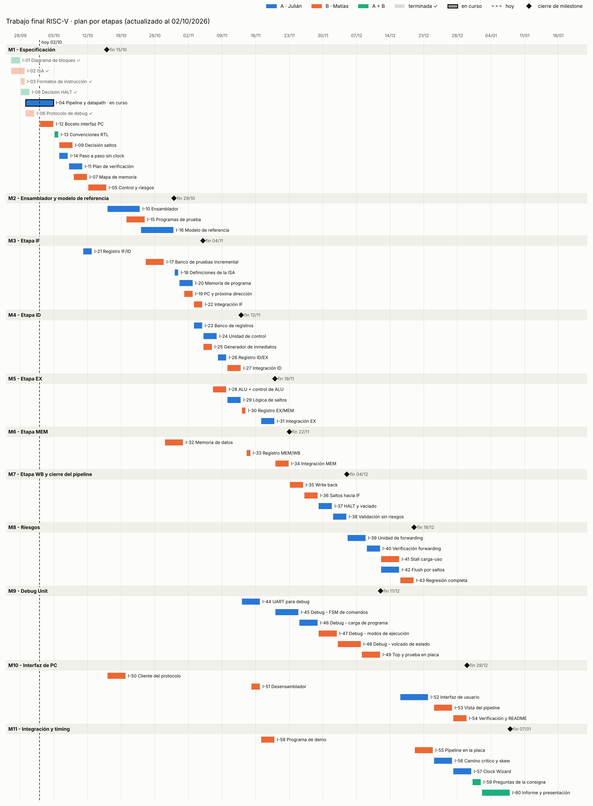
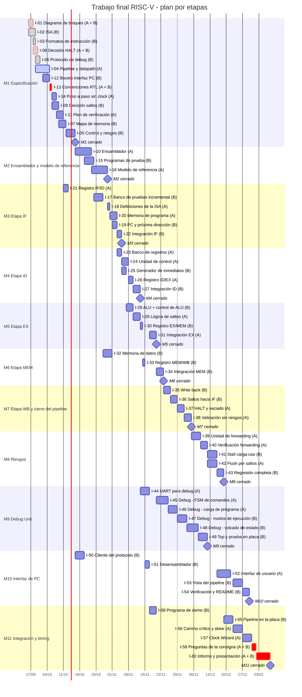

# Planificación

Cronograma estimado del trabajo final, con el pipeline construido **etapa por etapa**.
Los criterios de terminado de cada tarea están en los issues de GitHub.

## Enfoque por etapas

Cada etapa (IF, ID, EX, MEM, WB) es un milestone con el mismo ciclo:

1. Implementar los módulos de la etapa, cada uno con su testbench unitario.
2. Integrar la etapa al pipeline.
3. Validar el pipeline hasta esa etapa con el banco de pruebas incremental, que compara
   cada registro de segmentación contra la traza del modelo de referencia.

Los módulos de una etapa pueden adelantarse si la persona tiene tiempo libre (por
ejemplo, la unidad de control antes de cerrar IF), pero **la integración sigue siempre el
orden de las etapas**. Los riesgos (forwarding, stall y flush) se agregan recién con las
cinco etapas funcionando, porque involucran a varias a la vez.

## Supuestos de la estimación

- **Inicio real:** 26/09/2026 (primer issue de especificación; la reorganización del
  repositorio y las plantillas son del 24/09). **Fin estimado:** 07/01/2027.
- **Personas:** A es Julián Moreyra y B es Matías Costamagna.
- **Dedicación:** unas 10 a 12 horas por semana por persona. Un "día" del cronograma es un
  día de calendario con esa dedicación (incluye fines de semana), no una jornada completa.
- **Cada persona trabaja en un issue por vez.** Cuando se libera, toma el siguiente issue
  disponible; las etapas del pipeline tienen prioridad, y la Debug Unit y las herramientas
  llenan los huecos. Los issues *A + B* ocupan a los dos.
- **Carga total:** A 102 días, B 114 días (incluidos los compartidos). El plan original
  estaba equilibrado en 108 y 108; la diferencia viene de que B tomó el I-06 (6 días), que
  era de A.
- **Sin margen:** no incluye reserva para imprevistos, parciales de otras materias ni
  feriados. Las fiestas de fin de año caen en plena etapa de interfaz e integración.
- **Reprogramación al 02/10/2026:** M1 avanzó más rápido de lo estimado, así que las tareas
  pendientes de M1 se reprogramaron desde el 02/10 y **todas las tareas desde M2 en adelante
  se adelantaron 14 días**, sin cambiar su orden ni sus duraciones.
- Frente al plan anterior (monociclo y luego segmentación), este enfoque suma unos 10 días
  por persona: un registro de segmentación por issue, una integración por etapa y la traza
  por etapa en el modelo de referencia. A cambio, cada error queda acotado a la última
  etapa integrada.

## Avance al 02/10/2026

| Issue | Responsable | Inicio | Fin real | Estimado | Real | PR |
|---|---|---|---|---|---|---|
| I-01 Diagrama de bloques | A + B | 26/09 | 27/09 | 3 días | 2 días | #18 |
| I-02 ISA | B | 26/09 | 28/09 | 4 días | 3 días | #17, #20 |
| I-03 Formatos de instrucción | B | 28/09 | 28/09 | 2 días | 1 día | #21 |
| I-08 Decisión HALT | A + B | 28/09 | 29/09 | 2 días | 2 días | #22 |
| I-06 Protocolo de debug | B (era de A) | 29/09 | 30/09 | 6 días | 2 días | #23 |
| I-04 Pipeline y datapath | A | 29/09 | en curso | 6 días | — | sin PR (`docs/7_pipeline`) |

## Cómo se reparte el trabajo

Cada persona hace la mitad del proyecto **en cada área**, para que los dos conozcan todas
las partes del sistema y puedan defender cualquiera:

| Área | A | B |
|---|---|---|
| Especificación (M1) | 11 días | 25 días |
| Herramientas y programas (M2, M10, demo) | 20 días | 20 días |
| Pipeline: etapas y riesgos (M3 a M8) | 36 días | 38 días |
| Debug Unit (M9) | 13 días | 13 días |
| Integración y timing (M11) | 8 días | 4 días |
| Tareas conjuntas | 14 días | 14 días |

- **Pipeline:** en cada etapa los módulos se reparten entre los dos. En IF, ID, EX y
  riesgos, **quien integra la etapa no escribió la mayoría de sus módulos**: integrar
  obliga a entender el trabajo del otro.
- **Riesgos:** A hace el forwarding y el flush; B, el stall por carga-uso y la regresión
  completa.
- **Debug Unit:** A hace la UART, la FSM de comandos y la carga de programa; B, los modos
  de ejecución, el volcado de estado y la prueba en placa.
- **Herramientas:** A hace el ensamblador, el modelo de referencia y la interfaz; B, los
  programas de prueba, el cliente del protocolo, el desensamblador, la vista del pipeline,
  la verificación automática y el programa de demo.
- **Especificación:** también está repartida. B escribió la ISA, los formatos y el
  protocolo de debug (este último estaba asignado a A); A escribe el pipeline y el datapath.
  Como cada área se implementa entre los dos, cada documento lo usa también quien no lo
  escribió, y eso lo pone a prueba: por ejemplo, A implementa la UART, la FSM de comandos y
  la carga de programa a partir del protocolo que escribió B.
- **Integración final:** B lleva el pipeline a la placa; A hace el análisis de timing y el
  Clock Wizard.
- **La Debug Unit crece con el pipeline:** la carga de programa y el paso a paso funcionan
  desde la etapa IF, y la prueba en placa (I-49) se hace con el pipeline disponible en ese
  momento.

## Fechas por milestone

| Milestone | Fin estimado |
|---|---|
| M1 - Especificación | 15/10/2026 |
| M2 - Ensamblador y modelo de referencia | 29/10/2026 |
| M3 - Etapa IF | 04/11/2026 |
| M4 - Etapa ID | 12/11/2026 |
| M5 - Etapa EX | 19/11/2026 |
| M6 - Etapa MEM | 22/11/2026 |
| M7 - Etapa WB y cierre del pipeline | 04/12/2026 |
| M8 - Riesgos | 18/12/2026 |
| M9 - Debug Unit | 11/12/2026 |
| M10 - Interfaz de PC | 29/12/2026 |
| M11 - Integración y timing | 07/01/2027 |

M9 (Debug Unit) termina antes que M8 (Riesgos) porque lo lleva B en paralelo.

## Diagrama (Mermaid)

GitHub renderiza este bloque. Es la fuente editable del Gantt: al cambiar una fecha o una
duración, actualizalo acá. Las tareas compartidas aparecen resaltadas; las terminadas se
marcan con `done` y la que está en curso, con `active`.

## Cómo mantenerlo

- Revisen el cronograma al cerrar cada milestone y ajusten las fechas que se movieron.
- Si un issue tarda bastante más que lo estimado, anotá la duración real en el issue al
  cerrarlo: sirve para corregir las estimaciones siguientes.
- La fecha de vencimiento de cada milestone en GitHub debería coincidir con la tabla de arriba.
