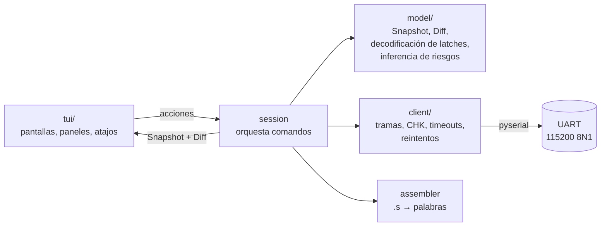
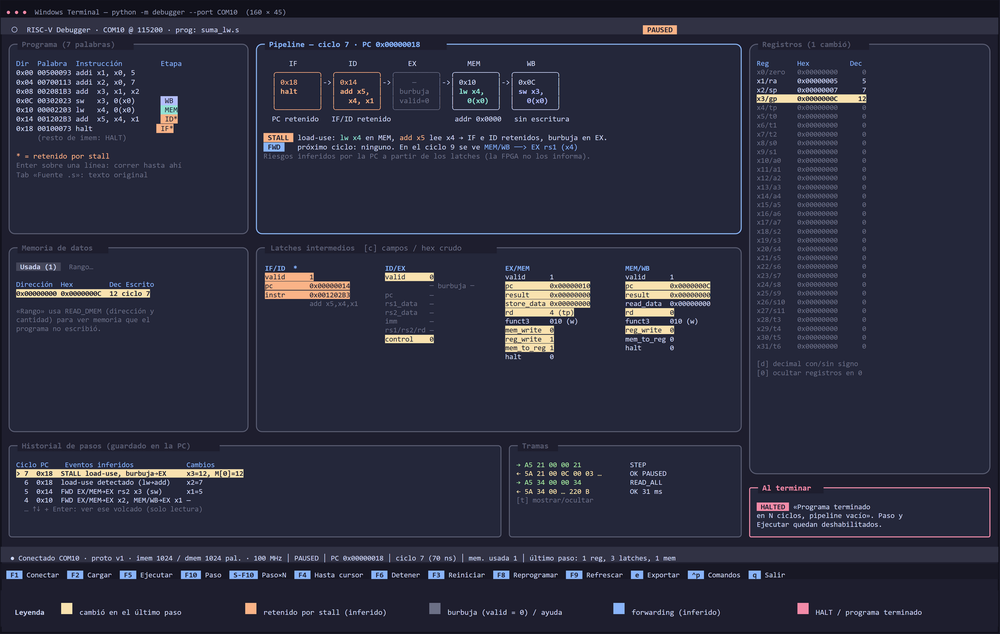
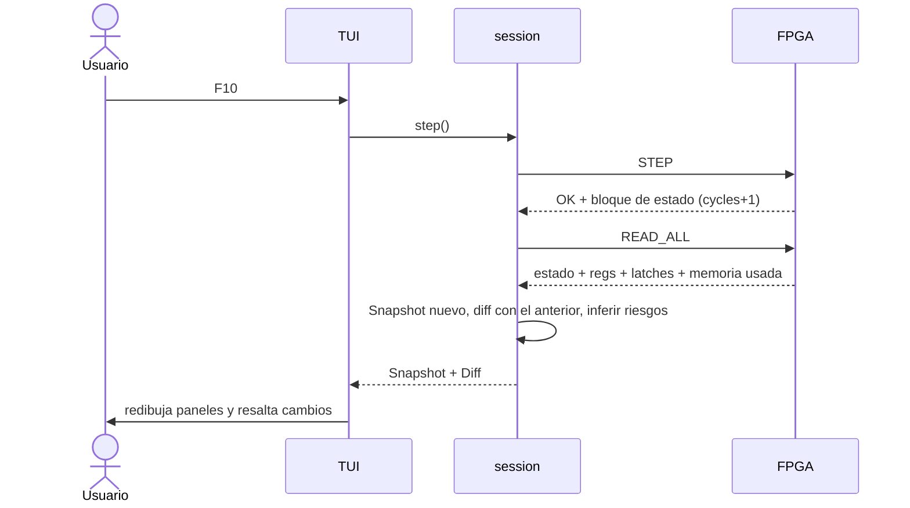

# Interfaz de la PC (debugger)

Cómo se ve y cómo se usa el programa de la PC que carga, ejecuta y observa el procesador por
la Debug Unit. Es el boceto previo a programarlo (I-52).

| | |
|---|---|
| **Tipo** | TUI (interfaz de texto a pantalla completa) con [Textual](https://textual.textualize.io/) — ver [decisión 008](../decisiones/008_interfaz-pc.md) |
| **Estado** | Propuesta, pendiente de revisión |
| **Depende de** | [`protocolo_debug.md`](protocolo_debug.md) (comandos y bloques), `pipeline.md` (campos de los latches), [`isa.md`](isa.md) (desensamblado) |
| **Boceto** | [`interfaz.drawio`](../diagramas/interfaz.drawio) / [`interfaz.png`](../diagramas/interfaz.png) |

## 1. Arquitectura del software

| Capa | Depende de Textual | Responsabilidad |
|---|---|---|
| `client` | No | Arma y valida tramas (`protocolo_debug.md` §2), timeouts y reintentos (§5), despacha `EVT_HALTED`. Un método por comando: `info()`, `load(words)`, `step()`, `read_all()`, … |
| `model` | No | `Snapshot` = bloque de estado + registros + latches + memoria usada de un instante. `diff(prev, cur)` dice qué cambió. Decodifica los latches en campos y deduce stalls y forwarding (§4.3). |
| `session` | No | Secuencias de comandos (paso = `STEP` + `READ_ALL`), historial de volcados, máquina de estados de qué controles están habilitados. |
| `tui` | Sí | Solo dibuja y traduce teclas a acciones de `session`. El puerto se lee en un *worker* en hilo (`@work(thread=True)`) que publica mensajes a la app. |

Así el cliente se testea con las tramas de ejemplo del protocolo sin terminal, y el modelo de
referencia (I-16) y los tests de integración lo usan sin levantar la TUI.

## 2. Pantalla principal

El boceto muestra el **ciclo 7** del programa de ejemplo, justo después de un `STEP`, con un
stall por load-use (`lw x4` seguido de `add x5, x4, x1`). Tamaño mínimo de la terminal:
**160 × 45**. Con menos, Historial y Tramas pasan a pestañas.

| Panel | Contenido | Fuente (comando) |
|---|---|---|
| Encabezado | Puerto, baudrate, archivo cargado y **estado del core** (`NO_PROG`, `READY`, `RUNNING`, `PAUSED`, `HALTED`) con un color por estado | Bloque de estado |
| **Programa** | Dirección, palabra en hex, instrucción desensamblada y una etiqueta con la **etapa** en la que está cada instrucción (IF, ID, EX, MEM, WB). Pestaña «Fuente .s» con el texto original y sus comentarios. | Lo que se envió con `LOAD` + PC de cada latch |
| **Pipeline** | Cinco cajas IF → WB con PC e instrucción de cada etapa. Burbujas en gris, etapas retenidas en naranja, HALT en rojo. Debajo, los riesgos inferidos (stall, forwarding) con la explicación. | `pc` del estado (IF) + `pc` y `valid` de cada latch |
| **Latches intermedios** | IF/ID, ID/EX, EX/MEM y MEM/WB campo por campo, con los nombres de `pipeline.md`. Tecla `c`: alterna entre campos y las palabras de 32 bits crudas. | `READ_LATCHES` (dentro de `READ_ALL`) |
| **Registros** | Los 32 registros con nombre ABI (`x1/ra`, `x2/sp`, …), hex y decimal. Los que valen 0 en gris. Tecla `d`: decimal con o sin signo; `0`: ocultar los que valen 0. | `READ_REGS` |
| **Memoria de datos** | Pestaña «Usada»: pares dirección/valor escritos por el programa y el ciclo en que se escribieron. Pestaña «Rango»: se pide dirección y cantidad. | `READ_DMEM_USED` / `READ_DMEM` |
| **Historial de pasos** | Un renglón por volcado: ciclo, PC, eventos inferidos y qué cambió. Enter sobre un renglón muestra ese volcado (solo lectura, la placa no vuelve atrás). | Volcados guardados en la PC |
| **Tramas** | Últimas tramas enviadas/recibidas en hex, con tiempo de respuesta. Oculto por defecto (`t`). | `client` |
| Barra de estado | Conexión, versión del protocolo, tamaños de memoria y frecuencia (de `INFO`), PC, ciclos (y su tiempo a `clk_khz`), palabras usadas y cuántas cosas cambiaron en el último paso | `INFO` + bloque de estado |
| Footer | Atajos de teclado (§3) | — |

### Colores

| Color | Significado |
|---|---|
| Amarillo | Cambió en el último paso (registro, campo de latch, palabra de memoria) |
| Naranja | Etapa o latch retenido por un stall (inferido) |
| Gris | Burbuja (`valid = 0`), registros en 0, texto de ayuda |
| Azul | Forwarding (inferido) |
| Rojo | HALT en vuelo o programa terminado |

## 3. Controles

Todos tienen atajo de teclado y también están en la paleta de comandos de Textual (`Ctrl+P`).
Los que no corresponden al estado actual se muestran deshabilitados en el footer (tabla de la
§3.7 del protocolo).

| Control | Tecla | Comandos enviados | Estados en que se puede |
|---|---|---|---|
| Conectar / desconectar | `F1` | Abrir puerto, `INFO` (verifica `proto_version`), `STATUS`, `READ_ALL` | Siempre |
| **Cargar programa** | `F2` | Elige un `.s` (o `.hex`/`.bin`), lo ensambla, muestra errores con línea; si está bien, `LOAD` + `READ_ALL` | Todos (en `RUNNING` pide confirmación) |
| **Ejecutar** (continuo) | `F5` | `RUN` y espera `EVT_HALTED` (§5) | `READY`, `PAUSED` |
| **Paso a paso** (un ciclo) | `F10` | `STEP` + `READ_ALL` (§4) | `READY`, `PAUSED` |
| Paso ×N | `Shift+F10` | N veces `STEP`; un solo `READ_ALL` al final. Se detiene antes si llega a `HALTED` | `READY`, `PAUSED` |
| Correr hasta cursor | `F4` | `STEP` hasta que el PC de WB sea la línea elegida o `HALTED` (usa el bloque de estado que devuelve cada `STEP`), luego `READ_ALL` | `READY`, `PAUSED` |
| **Detener** | `F6` | `STOP` + `READ_ALL` | `RUNNING` (en los demás no hace nada) |
| **Reiniciar** | `F3` | `RESET` + `READ_ALL`. Vuelve a correr el mismo programa desde cero | Todos |
| **Reprogramar** | `F8` | Igual que Cargar, pero vuelve a ensamblar el archivo ya abierto (para editar el `.s` y recargarlo sin buscarlo). `LOAD` limpia todo (decisión 004) | Todos (en `RUNNING` pide confirmación) |
| Refrescar | `F9` | `READ_ALL` | Todos menos `RUNNING` |
| Exportar volcado | `e` | Guarda el `Snapshot` actual (y el historial) en JSON, con el mismo formato que el modelo de referencia (I-16) para compararlos | Siempre |
| Salir | `q` | Cierra el puerto | Siempre |

«Correr hasta cursor» y «Paso ×N» se resuelven en la PC con `STEP` repetidos: no requieren
comandos nuevos en la Debug Unit. Un `STEP` con su respuesta son 23 bytes (~2 ms a 115200 más
la latencia del USB), así que 100 ciclos tardan menos de un segundo.

## 4. Modo paso a paso

### 4.1 Secuencia de un paso

Un paso completo son ~250 bytes de ida y vuelta: **~30 ms**, imperceptible.

### 4.2 Qué se muestra en cada paso

Cada `STEP` avanza **un ciclo de reloj** (no una instrucción). Después de cada paso:

1. **Pipeline:** cada instrucción avanza una caja. Lo que se ve en cada etapa es lo que esa
   etapa está procesando *ahora* (con el core detenido): IF = PC del bloque de estado,
   ID = IF/ID, EX = ID/EX, MEM = EX/MEM, WB = MEM/WB.
2. **Programa:** se mueven las etiquetas de etapa junto a cada instrucción.
3. **Resaltado de cambios:** en amarillo los registros, campos de latch y palabras de memoria
   que cambiaron respecto del volcado anterior. El resaltado dura **un paso**. El título de
   cada panel dice cuántos cambiaron («Registros (1 cambió)»).
4. **Historial:** se agrega un renglón con el ciclo, el PC, los eventos inferidos y un
   resumen de cambios (`x3=12, M[0]=12`).
5. **Barra de estado:** ciclo, tiempo equivalente (`cycles / clk_khz`) y resumen del paso.
6. Si el paso dejó el core en **`HALTED`** (el HALT llegó a WB): aviso «Programa terminado en
   N ciclos, pipeline vacío», el pipeline se ve con las cinco cajas vacías y se deshabilitan
   Paso y Ejecutar hasta un `RESET` o `LOAD`.

### 4.3 Riesgos inferidos

La Debug Unit no informa stalls ni forwarding; la PC los **deduce** de dos volcados seguidos
y de los campos de los latches. Se marcan como «inferidos» para que quede claro que no los
leyó del hardware. Si no coinciden con lo que hace el core, es una pista de un error en la
unidad de riesgos.

| Evento | Regla (sobre el volcado actual) |
|---|---|
| Stall load-use (próximo ciclo) | `ID/EX.mem_read = 1`, `ID/EX.rd ≠ 0`, `IF/ID.valid = 1` y `ID/EX.rd ∈ {rs1, rs2}` de la instrucción en IF/ID, sin `redirect` en el mismo ciclo |
| Stall ocurrido | Respecto del volcado anterior: PC e IF/ID no cambiaron, `ID/EX.valid = 0` y `cycles` aumentó en 1 |
| Forwarding EX/MEM → EX | `EX/MEM.valid`, `EX/MEM.reg_write`, `EX/MEM.rd ≠ 0` y `EX/MEM.rd = ID/EX.rs1` o `rs2` |
| Forwarding MEM/WB → EX | Igual con MEM/WB, si EX/MEM no tiene prioridad sobre el mismo registro |
| Flush por salto | Burbujas en IF/ID e ID/EX con el PC fuera de secuencia respecto del volcado anterior |
| HALT en vuelo | Bit `halt` en algún latch |

Las reglas siguen las ecuaciones de `pipeline.md` §10 (unidad de riesgos, I-05); se ajustan si
I-09 cambia la etapa de resolución de saltos.

### 4.4 Errores durante un paso

Si el `STEP` no responde, **no se reintenta a ciegas** (protocolo §5): se manda `STATUS` y,
si `cycles` aumentó en 1, el paso se dio por hecho y solo se repite el `READ_ALL`. Los errores
se ven como una notificación (*toast* de Textual) y en el panel de Tramas.

## 5. Modo continuo

1. `F5` manda `RUN`. El encabezado pasa a **`RUNNING`** (verde) y quedan habilitados solo
   Detener, Reiniciar, Cargar y Reprogramar (y `STATUS`, que manda la PC sola).
2. Mientras corre, la PC manda `STATUS` cada 500 ms para mostrar el contador de ciclos en la
   barra de estado. Los paneles de registros, latches y memoria muestran el último volcado,
   atenuados, porque las lecturas no se permiten en `RUNNING`.
3. Al llegar el `EVT_HALTED`: `READ_ALL` y se muestra el estado final. El resaltado compara
   con el volcado **anterior al `RUN`**, así se ve todo lo que cambió el programa.
4. Si pasan 5 s (configurable) sin `EVT_HALTED`, aviso: «El programa no termina (¿bucle sin
   HALT?) · [Detener] [Seguir esperando]». Detener manda `STOP` y deja el core en `PAUSED`,
   desde donde se puede seguir paso a paso.

## 6. Requisitos por sistema

La TUI tiene que andar igual en Windows (PC de los integrantes) y en Linux (laboratorio). Se
prueba en las dos plataformas desde el comienzo de I-52.

### Terminal

| | Windows | Linux |
|---|---|---|
| Terminal | **Windows Terminal**. La consola clásica (`conhost`) no muestra bien los colores ni los caracteres de caja | Cualquier terminal del escritorio: GNOME Terminal, Konsole, kitty, Alacritty, WezTerm. **No** la consola de texto sin entorno gráfico (`Ctrl+Alt+F3`): solo tiene 8/16 colores y fuente limitada |
| Colores | 24 bits | 24 bits en las terminales de arriba. En `xterm` o terminales viejas, 256 colores: Textual aproxima los tonos y funciona igual |
| Codificación | UTF-8 (por defecto en Windows Terminal) | Locale UTF-8. Si los bordes salen como `?`: `export LANG=C.UTF-8` |
| Dentro de `tmux` | — | Para tener 24 bits: `set -as terminal-features ",*:RGB"` en `.tmux.conf` |
| Tamaño mínimo | 160 × 45 | 160 × 45 |

**Símbolos:** en las columnas que tienen que quedar alineadas (programa, pipeline, latches,
registros, historial) se usan solo ASCII y caracteres de caja (`─│╭╮╰╯`). Símbolos como `⏸` o
`▶` se dibujan con ancho doble en algunas fuentes y desalinean las columnas; por eso la marca de
etapa retenida es `*` y la fila actual del historial se marca con `>`.

### Puerto serie

| | Windows | Linux |
|---|---|---|
| Nombre | `COMn` | `/dev/ttyUSBn`. El FT2232 de la Basys 3 crea dos interfaces (JTAG y UART); la UART suele ser la segunda (`ttyUSB1`) |
| Permisos | — | El usuario tiene que estar en el grupo `dialout` (`uucp` en Arch): `sudo usermod -aG dialout $USER` y volver a iniciar sesión. Si no, `Permission denied` al abrir el puerto |
| Otros procesos | Cerrar cualquier terminal serie (PuTTY, el monitor serie de Vivado) | Además, **ModemManager** puede tomar el puerto al conectar la placa y mandar bytes. El protocolo lo tolera (en reposo la FPGA descarta todo hasta un `0xA5`) y el reintento del primer `INFO` lo cubre. Si molesta: `sudo systemctl stop ModemManager` |

Para no depender del nombre, `F1` (Conectar) lista los puertos con
`serial.tools.list_ports` y propone el que tenga el VID/PID de FTDI (`0403:6010`). También se
puede pasar `--port` por línea de comandos.

## 7. Pendiente

- Los campos de cada latch se toman de `pipeline.md` (rama `docs/7_pipeline`); si cambian,
  se actualiza solo la tabla del decodificador en `model`.
- La salida del ensamblador (formato de errores, `.hex`) se define con su issue.
- El formato del JSON exportado se acuerda con el modelo de referencia (I-16).

## 8. Checklist de revisión

- [ ] TUI con Textual y separación `client` / `model` / `session` / `tui` (decisión 008)
- [ ] Paneles del boceto: programa, pipeline, latches, registros, memoria usada, historial
- [ ] Lista de controles, atajos y en qué estados se habilitan
- [ ] Qué se muestra en cada paso y cómo se resaltan los cambios
- [ ] Reglas para inferir stalls y forwarding
- [ ] Comportamiento del modo continuo y del watchdog
- [ ] Requisitos de terminal y de puerto serie en Windows y Linux