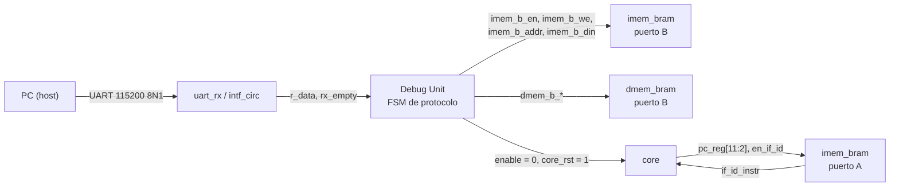

# Memorias: tamaños, mapa de direcciones y acceso

Fija el tamaño y el rango de direcciones de la memoria de programa (`imem`) y de la de datos
(`dmem`), cómo se implementan en la Basys 3, quién accede por cada puerto y qué pasa con los
accesos por byte, desalineados o fuera de rango. Es la referencia para escribir
`rtl/memory/`, la parte de memoria de la Debug Unit, el ensamblador y el modelo de referencia.

| | |
|---|---|
| **Issue** | I-07 — Mapa de memoria |
| **Estado** | Propuesta, pendiente de revisión |
| **Decisiones** | [013](../decisiones/013_tamano-y-mapa-de-memorias.md) tamaño y mapa · [014](../decisiones/014_bram-y-escritura-de-programa.md) BRAM y escritura de la memoria de programa · [015](../decisiones/015_accesos-desalineados-y-fuera-de-rango.md) desalineados y fuera de rango · [016](../decisiones/016_acceso-por-byte.md) acceso por byte y media palabra |
| **Depende de** | [`pipeline.md`](pipeline.md) (§3.2, §6, §7.1), [`protocolo_debug.md`](protocolo_debug.md) (`LOAD`, `RESET`, `READ_DMEM*`), decisiones [004](../decisiones/004_carga-y-reprogramacion.md), [005](../decisiones/005_memoria-de-datos-usada.md) y [009](../decisiones/009_memorias-sincronicas.md) |

---

## 1. Resumen

| | Memoria de programa (`imem`) | Memoria de datos (`dmem`) |
|---|---|---|
| Tamaño | 1024 palabras × 32 bits = **4 KiB** | 1024 palabras × 32 bits = **4 KiB** |
| Rango válido | `0x0000_0000` – `0x0000_0FFF` | `0x0000_0000` – `0x0000_0FFF` (otro espacio, §2) |
| Índice de palabra | `pc[11:2]` | `addr[11:2]` |
| Parámetro RTL | `IMEM_AW = 10` | `DMEM_AW = 10` |
| Implementación | Block Memory Generator, *True Dual Port*, 1 RAMB36E1 | Ídem, con *byte write enable* (`we[3:0]`) |
| Puerto A | Core (IF): solo lectura | Core (MEM): lectura y escritura por byte |
| Puerto B | Debug Unit: solo escritura (`LOAD`) | Debug Unit: lectura (volcado) y escritura (limpieza) |
| Latencia de lectura | 1 ciclo, sin registro de salida extra | 1 ciclo, sin registro de salida extra |
| Contenido al configurar la FPGA | HALT (`0x0010_0073`) en todas las palabras | Ceros |
| Valor que informa `INFO` | `imem_words = 1024` | `dmem_words = 1024` |

Valor de reset del PC: **`0x0000_0000`**, la primera palabra de `imem`.

Recursos: 2 RAMB36E1 de las 50 del `xc7a35t` (4 %), más ~20 LUT para el mapa de palabras
usadas (§7) y 3 flip-flops de avisos (§6.2).

---

## 2. Mapa de direcciones

La arquitectura es **Harvard**: hay dos espacios de direcciones independientes. El PC solo
direcciona `imem` y los loads/stores solo direccionan `dmem`. Los dos empiezan en `0`; como
son memorias físicamente separadas, una misma dirección numérica no genera ambigüedad: el core
no puede leer instrucciones como datos ni ejecutar la memoria de datos.

```
Espacio de instrucciones (PC)            Espacio de datos (loads / stores)

0xFFFF_FFFF ┌──────────────────────┐      0xFFFF_FFFF ┌──────────────────────┐
            │ no mapeado           │                  │ no mapeado           │
            │ alias de imem (§6)   │                  │ alias de dmem (§6)   │
0x0000_1000 ├──────────────────────┤      0x0000_1000 ├──────────────────────┤
0x0000_0FFC │ imem[1023]           │      0x0000_0FFC │ dmem[1023]           │ ◄─ tope de la pila
            │ …                    │                  │ …                    │    (convención, §2.2)
0x0000_0004 │ imem[1]              │      0x0000_0004 │ dmem[1]              │
0x0000_0000 │ imem[0]  ◄─ PC reset │      0x0000_0000 │ dmem[0]              │
            └──────────────────────┘                  └──────────────────────┘
```

### 2.1 Cómo se descompone una dirección

```
 31                      12 11                     2  1   0
┌──────────────────────────┬────────────────────────┬───────┐
│  fuera de rango si ≠ 0   │ índice de palabra (10) │ byte  │
└──────────────────────────┴────────────────────────┴───────┘
        ignorados               a la BRAM              offset (§5)
```

```
IMEM_WORDS = 1 << IMEM_AW = 1024        IMEM_BYTES = 4 * IMEM_WORDS = 4096
DMEM_WORDS = 1 << DMEM_AW = 1024        DMEM_BYTES = 4 * DMEM_WORDS = 4096

índice imem = pc[IMEM_AW+1:2]           índice dmem = addr[DMEM_AW+1:2]
fuera de rango (imem) = |pc[31:IMEM_AW+2]
fuera de rango (dmem) = |addr[31:DMEM_AW+2]
```

Como los tamaños son potencias de dos, la decodificación de direcciones es solo elegir bits:
no hay comparadores ni lógica en el camino de la dirección hacia la BRAM.

### 2.2 Convenciones para los programas (ensamblador y programas de prueba)

- **Código desde `0x0000_0000`.** El ensamblador (I-10) genera las palabras a partir de la
  dirección 0 y rechaza un programa de más de 1024 palabras, contando el HALT final.
- **No hay sección `.data` inicializada.** `LOAD` solo escribe `imem` y pone `dmem` en cero
  (decisión 004), así que los datos se arman en tiempo de ejecución con stores.
- **Datos desde `0x000`.** Con base `x0` se alcanzan las direcciones `0x000`–`0x7FF` en una sola
  instrucción (`lw x5, 16(x0)`), porque el inmediato es de 12 bits con signo. Para `0x800`–`0xFFF`
  hace falta un registro base.
- **Pila desde `0x1000` hacia abajo** (si un programa la usa): `lui sp, 1` deja `sp = 0x1000` y
  el primer `addi sp, sp, -4` apunta a la última palabra, `0xFFC`.

---

## 3. Implementación con BRAM

### 3.1 Por qué 1024 palabras ocupan exactamente una BRAM

Las dos memorias necesitan dos puertos de 32 bits. En el Artix-7, un bloque RAMB18 en modo
*True Dual Port* tiene como máximo 18 bits por puerto, así que una memoria de 32 bits en TDP
arranca en un RAMB36 (configurado como 1K × 36). Una memoria más chica ocupa la misma BRAM, y
una de 2K palabras ya ocupa dos. Detalle en la decisión [013](../decisiones/013_tamano-y-mapa-de-memorias.md).

### 3.2 Configuración del Block Memory Generator

Los dos IP se generan con scripts `ip/imem_bram.tcl` e `ip/dmem_bram.tcl`, que
`scripts/create_project.tcl` ya ejecuta (I-20 e I-32).

| Opción del IP | `imem_bram` | `dmem_bram` | Por qué |
|---|---|---|---|
| *Memory Type* | True Dual Port RAM | True Dual Port RAM | Puerto A del core y puerto B de la Debug Unit (decisión 014) |
| Ancho / profundidad (A y B) | 32 / 1024 | 32 / 1024 | §1 |
| *Enable Port Type* | Use ENA / ENB pin | Use ENA / ENB pin | El `ena` del puerto A implementa el stall y el core detenido (decisión 009) |
| *Primitives Output Register* (A y B) | **No** | **No** | Con el registro la latencia pasa a 2 ciclos y deja de coincidir con IF/ID y MEM/WB (§3.4) |
| *Core Output Register* | No | No | Ídem |
| *Byte Write Enable* | No (`wea`, `web` de 1 bit) | **Sí**, byte de 8 bits (`wea[3:0]`, `web[3:0]`) | `sb`/`sh` (decisión 016) |
| *Operating Mode* puerto A | Indistinto (solo lee) | `READ_FIRST` | En un store el latch MEM/WB muestra la palabra que había antes; con escritura por bytes queda bien definido |
| *Operating Mode* puerto B | Indistinto | Indistinto | La Debug Unit nunca lee y escribe la misma dirección en un ciclo |
| Pines `RSTA`/`RSTB` | No | No | Opcional: decisión 009, "alternativa a evaluar" |
| Contenido inicial | *Fill remaining* = `00100073` (HALT) | Ceros (sin archivo) | §3.6 |
| Reloj | `clka = clkb = clk_sys` | `clka = clkb = clk_sys` | Un único dominio de reloj; sin cruces |

Referencia para el script (a validar al generarlo en Vivado):

```tcl
create_ip -name blk_mem_gen -vendor xilinx.com -library ip -module_name dmem_bram
set_property -dict [list \
    CONFIG.Memory_Type {True_Dual_Port_RAM} \
    CONFIG.Write_Width_A {32} CONFIG.Read_Width_A {32} CONFIG.Write_Depth_A {1024} \
    CONFIG.Write_Width_B {32} CONFIG.Read_Width_B {32} \
    CONFIG.Enable_A {Use_ENA_Pin} CONFIG.Enable_B {Use_ENB_Pin} \
    CONFIG.Register_PortA_Output_of_Memory_Primitives {false} \
    CONFIG.Register_PortB_Output_of_Memory_Primitives {false} \
    CONFIG.Use_Byte_Write_Enable {true} CONFIG.Byte_Size {8} \
    CONFIG.Operating_Mode_A {READ_FIRST} \
] [get_ips dmem_bram]
# imem_bram: igual, con Use_Byte_Write_Enable {false} y
#   CONFIG.Fill_Remaining_Memory_Locations {true} CONFIG.Remaining_Memory_Locations {00100073}
```

Se sugiere envolver cada IP en un módulo propio (`rtl/memory/imem.v`, `rtl/memory/dmem.v`)
con los nombres de puertos de §3.3, para que el pipeline no dependa de los nombres que genera
el IP y un cambio de configuración no toque el resto del RTL.

### 3.3 Conexión de los puertos

**Memoria de programa**

| Puerto | Señal del IP | Conectada a | Notas |
|---|---|---|---|
| A (core) | `addra[9:0]` | `pc_reg[11:2]` | Dirección desde un registro (decisión 009) |
| | `ena` | `en_if_id` | `enable & ~stall` (`pipeline.md` §10.4) |
| | `wea`, `dina` | `0` | El core nunca escribe la memoria de programa |
| | `douta[31:0]` | `if_id_instr` | El registro de salida de la BRAM es el campo de IF/ID |
| B (Debug Unit) | `addrb[9:0]` | `imem_b_addr` | Puntero de escritura de la Debug Unit |
| | `enb`, `web` | `imem_b_en`, `imem_b_we` | Un pulso de un ciclo por palabra (§4) |
| | `dinb[31:0]` | `imem_b_din` | Palabra armada desde la UART |
| | `doutb` | sin conectar | Disponible para un futuro `READ_IMEM` sin regenerar el IP |

**Memoria de datos**

| Puerto | Señal del IP | Conectada a | Notas |
|---|---|---|---|
| A (core) | `addra[9:0]` | `ex_mem_result[11:2]` | Bits altos y offset se ignoran (§5, §6) |
| | `ena` | `en_mem_wb` | `= enable`; con el core detenido el dato leído no cambia |
| | `wea[3:0]` | máscara de bytes si `mem_write`, si no `0000` | `pipeline.md` §6.2 |
| | `dina[31:0]` | dato del store replicado | `pipeline.md` §6.2 |
| | `douta[31:0]` | `mem_wb_read_data` | Se extiende en WB (`pipeline.md` §7.1) |
| B (Debug Unit) | `addrb[9:0]` | `dmem_b_addr` | |
| | `enb` | `dmem_b_en` | |
| | `web[3:0]` | `1111` al limpiar, `0000` al leer | |
| | `dinb[31:0]` | `0` | La Debug Unit solo escribe ceros |
| | `doutb[31:0]` | Debug Unit | `READ_DMEM`, `READ_DMEM_USED`, `READ_ALL` |

### 3.4 Latencia de lectura y efecto sobre el pipeline

Las dos BRAM entregan el dato **un ciclo después** de recibir la dirección. La decisión
[009](../decisiones/009_memorias-sincronicas.md) ya fija cómo se absorbe esa latencia sin agregar
etapas; en resumen:

| | Memoria de programa (IF) | Memoria de datos (MEM) |
|---|---|---|
| Dirección | `pc_reg` (registro) | `ex_mem_result` (registro) |
| Salida registrada de la BRAM | Es `if_id_instr` | Es `mem_wb_read_data` |
| Stall / core detenido | `ena = en_if_id` | `ena = en_mem_wb` |
| Flush | La salida no se borra: `if_id_valid = 0` (`pipeline.md` §3.3) | No hay flush de MEM/WB |
| Costo en ciclos | Ninguno | Ninguno; el load-use sigue costando 1 stall (`pipeline.md` §10.3) |
| Lo que se mueve de lugar | La instrucción se decodifica a la salida de la BRAM | La extensión de `lb`/`lh`/`lbu`/`lhu` pasa a WB |

**Impacto en el camino crítico.** Sin registro de salida extra, el tiempo de *clock-to-out* de la
BRAM (del orden de 2 ns en un Artix-7 `-1`, a confirmar en el reporte de timing) es el comienzo
del camino crítico candidato de la decisión
[012](../decisiones/012_resolucion-saltos.md) (dato de un load → extensión → forwarding → ALU →
`redirect` → PC). Activar el *Primitives Output Register* acortaría ese tramo, pero sumaría un
ciclo a cada búsqueda y a cada load: 2 stalls por load-use y 3 ciclos por salto tomado. Se
revisa solo si el análisis de timing (I-56) muestra que la BRAM limita la frecuencia.

### 3.5 Concurrencia entre puertos

El core y la Debug Unit nunca acceden a la misma BRAM a la vez, así que no hay colisiones entre
puertos ni hace falta arbitraje:

| Estado de la Debug Unit | Puerto A (core) | Puerto B de `imem` | Puerto B de `dmem` |
|---|---|---|---|
| `RUNNING`, ciclo de `STEP` (`enable = 1`) | Activo | Inactivo | Inactivo |
| `LOAD` (recepción y limpieza), `RESET` | Inactivo (`core_rst = 1`, `enable = 0`) | Escribe | Escribe ceros |
| Lecturas (`READ_*`) en `READY`, `PAUSED`, `HALTED` | Inactivo (`enable = 0`) | Inactivo | Lee |

Con `enable = 0` los `ena` del puerto A valen 0 (`pipeline.md` §10.4), así que el puerto A ni
siquiera está habilitado mientras la Debug Unit usa el B.

### 3.6 Contenido inicial

Al configurar la FPGA, `imem` está llena de HALT (opción *Fill remaining* del IP) y `dmem` en
cero. La Debug Unit arranca en `NO_PROG`, que no acepta `RUN` ni `STEP`, así que ese contenido
no se ejecuta en el uso normal; sirve de red de seguridad y para que una simulación que
arranque el core sin cargar programa se detenga sola. En los testbenches del pipeline previos a
la Debug Unit (I-22 en adelante) el programa se puede cargar con un archivo `.coe` generado por el
ensamblador.

---

## 4. Escritura de la memoria de programa desde la Debug Unit

El único camino para escribir `imem` es el comando `LOAD` del protocolo
([`protocolo_debug.md`](protocolo_debug.md) §3.3), por el **puerto B** y **con el core en reset**.
El porqué de este mecanismo frente a las alternativas está en la decisión
[014](../decisiones/014_bram-y-escritura-de-programa.md).



### 4.1 Condición: core en reset

Desde que se acepta el encabezado de un `LOAD` hasta que termina la limpieza, la Debug Unit
mantiene `enable = 0` y `core_rst = 1`:

- Con `enable = 0` el puerto A está deshabilitado: no hay lecturas concurrentes de una dirección
  que se está escribiendo (§3.5).
- Con `core_rst = 1` el PC vale 0, los registros 0 y todos los registros de segmentación son
  burbujas: ninguna instrucción del programa anterior queda en vuelo
  ([decisión 004](../decisiones/004_carga-y-reprogramacion.md)).

Por eso `LOAD` se acepta en cualquier estado, incluso `RUNNING`: lo primero que hace es detener
y resetear el core. La memoria de programa **nunca se escribe con el core ejecutando**.

### 4.2 Secuencia

Los estados son los de la FSM de protocolo ([`debug_unit_fsm`](../diagramas/debug_unit_fsm.png)):

| Estado | Qué pasa con la memoria de programa |
|---|---|
| `CHECK_HDR` | Valida `LEN` múltiplo de 4 y `1 ≤ N ≤ IMEM_WORDS` (`N = LEN / 4`). Si falla: `ERR_LENGTH` y la memoria no se toca |
| `LOAD_PREP` | 1 ciclo: `enable = 0`, `core_rst = 1`, `prog_valid = 0`, `wptr = 0`, `byte_cnt = 0` |
| `RX_PAYLOAD` | Arma cada palabra con 4 bytes (little-endian) y la escribe en `imem[wptr]` por el puerto B |
| `RX_CHK` | Compara el checksum. Si está mal: `ERR_CHECKSUM`, queda `NO_PROG` (§4.3) |
| `CLEAR` | Rellena `imem[N … 1023]` con HALT y, en el mismo recorrido, pone en cero `dmem` y el mapa de usadas |
| fin de `CLEAR` | `core_rst = 0`, `prog_valid = 1`, estado `READY`, responde OK |

Armado y escritura de las palabras en `RX_PAYLOAD` (un byte nuevo cada ~87 µs a 115200):

```verilog
// por cada byte recibido (rx_strobe = 1, rx_byte = r_data)
word_sr  <= {rx_byte, word_sr[31:8]};   // el primer byte recibido termina en [7:0]
byte_cnt <= byte_cnt + 1;               // 2 bits, cuenta 0..3

assign last_byte   = rx_strobe & (byte_cnt == 2'd3);
assign imem_b_en   = last_byte;
assign imem_b_we   = last_byte;
assign imem_b_addr = wptr;
assign imem_b_din  = {rx_byte, word_sr[31:8]};   // la palabra completa, con el 4.º byte

// después de escribir
if (last_byte) wptr <= wptr + 1;
```

Ejemplo con el `LOAD` de `protocolo_debug.md` §4 (`addi x1, x0, 5` y `halt`):

| Bytes del payload | Palabra | Escritura |
|---|---|---|
| `93 00 50 00` | `0x0050_0093` | `imem[0]` |
| `73 00 10 00` | `0x0010_0073` | `imem[1]` |
| — (`CLEAR`) | `0x0010_0073` | `imem[2]` … `imem[1023]` |

Recorrido de `CLEAR` (un ciclo por dirección):

```
para a = 0 … max(IMEM_WORDS, DMEM_WORDS) − 1:
    si es LOAD y N ≤ a < IMEM_WORDS:  imem[a] ← 0x0010_0073      (puerto B de imem)
    si a < DMEM_WORDS:                dmem[a] ← 0, used[a] ← 0    (puerto B de dmem, web = 1111)
```

Son 1024 ciclos: ~10 µs a 100 MHz, despreciables frente a los ~0,36 s que tarda en llegar un
programa de 1024 palabras a 115200 baud. `RESET` hace el mismo recorrido sin la parte de `imem`.

### 4.3 Errores durante la carga

| Caso | Memoria de programa | Estado posterior |
|---|---|---|
| `ERR_LENGTH` (`N = 0`, `N > 1024` o `LEN` no múltiplo de 4) | Intacta | El que tenía (el `LOAD` no tuvo efecto) |
| `ERR_CHECKSUM` | Escrita con el programa nuevo, sin relleno | `NO_PROG`, core en reset, `prog_valid = 0` |
| `ERR_TIMEOUT` a mitad del payload | Escrita hasta la palabra que llegó completa | `NO_PROG`, core en reset, `prog_valid = 0` |

En los dos últimos casos el contenido de `imem` es una mezcla y no debe ejecutarse: `NO_PROG`
no acepta `RUN` ni `STEP`, y la PC repite el `LOAD` completo. La Debug Unit no valida el
contenido de las palabras: una palabra que no es una instrucción del ISA se ejecuta como NOP
(`pipeline.md` §4.4).

### 4.4 Arranque después de la carga

Al terminar `CLEAR`, `core_rst` vuelve a 0 con `enable = 0`. Con el primer ciclo habilitado (por
`RUN` o `STEP`) la BRAM lee la dirección 0 y la primera instrucción entra a IF/ID:

```
ciclo                   t (primer enable)    t+1
pc_reg                  0                    4
BRAM lee                imem[0]              imem[1]
if_id_instr (salida)    basura del reset     instr(0)
if_id_valid             0                    1
```

La salida de la BRAM después del reset es basura, pero llega con `if_id_valid = 0` y se trata como
burbuja (`pipeline.md` §3.3).

---

## 5. Acceso por byte, media palabra y palabra

Se soportan los cinco loads (`lb`, `lh`, `lw`, `lbu`, `lhu`) y los tres stores (`sb`, `sh`, `sw`)
en un solo acceso, usando el *byte write enable* de la BRAM para escribir y seleccionando la parte
en WB para leer. La memoria es **little-endian** (igual que RISC-V y que el protocolo): el byte de
la dirección `a` está en los bits `[8·(a mod 4) + 7 : 8·(a mod 4)]` de su palabra. El porqué está
en la decisión [016](../decisiones/016_acceso-por-byte.md); las fórmulas, en `pipeline.md` §6.2
(stores) y §7.1 (loads).

```
dirección        0x103     0x102     0x101     0x100
palabra 0x100 = [ 31:24 ] [ 23:16 ] [ 15:8  ] [  7:0  ]
                  byte 3    byte 2    byte 1    byte 0
```

Ejemplos con la palabra `0xDEAD_BEEF` en `0x100` (`EF` en `0x100`, `BE` en `0x101`, `AD` en
`0x102`, `DE` en `0x103`):

| Instrucción | Dirección | `we[3:0]` / parte leída | Resultado |
|---|---|---|---|
| `lw` | `0x100` | palabra | `rd = 0xDEAD_BEEF` |
| `lb` | `0x101` | byte 1 (`0xBE`) | `rd = 0xFFFF_FFBE` |
| `lbu` | `0x101` | byte 1 (`0xBE`) | `rd = 0x0000_00BE` |
| `lh` | `0x102` | bytes 3–2 (`0xDEAD`) | `rd = 0xFFFF_DEAD` |
| `lhu` | `0x102` | bytes 3–2 (`0xDEAD`) | `rd = 0x0000_DEAD` |
| `sb` con `rs2 = 0x12` | `0x102` | `0100`, `wdata = 0x1212_1212` | palabra = `0xDE12_BEEF` |
| `sh` con `rs2 = 0x3456` | `0x102` | `1100`, `wdata = 0x3456_3456` | palabra = `0x3456_BEEF` |
| `sw` con `rs2 = 0x0BAD_F00D` | `0x100` | `1111` | palabra = `0x0BAD_F00D` |

Un `sb` o `sh` marca como usada la palabra completa que contiene el byte (decisión 005).

---

## 6. Accesos desalineados y fuera de rango

### 6.1 Qué hace el hardware

El ISA implementado no tiene excepciones, así que el core **no se detiene ni avisa en el
momento**: el hardware ignora los bits que no corresponden y el acceso cae en una posición válida.
A cambio, cada caso deja un **aviso persistente** que la PC ve en el bloque de estado (§6.2).
Decisión [015](../decisiones/015_accesos-desalineados-y-fuera-de-rango.md).

| Caso | Qué hace el hardware | Aviso |
|---|---|---|
| `lb`, `lbu`, `sb` | Nunca están desalineados | — |
| `lh`, `lhu`, `sh` con `addr[0] = 1` | Accede a la media palabra alineada que lo contiene (`addr & ~1`) | `dmem_misaligned` |
| `lw`, `sw` con `addr[1:0] ≠ 00` | Accede a la palabra alineada que lo contiene (`addr & ~3`) | `dmem_misaligned` |
| Load o store con `addr ≥ 0x1000` | Accede a `addr mod 4096` (los bits `[31:12]` se ignoran) | `dmem_oob` |
| PC `≥ 0x1000` (un `jal`/`jalr`/branch a un destino fuera de rango) | Busca `imem[pc[11:2]]` | `imem_fault` |
| PC con `pc[1] = 1` (destino de `jalr` o branch no múltiplo de 4) | Busca la palabra que lo contiene | `imem_fault` |
| El programa termina sin HALT | No pasa: `LOAD` rellena el resto con HALT. Solo con un programa de exactamente 1024 palabras sin HALT el PC llega a `0x1000`, vuelve a `imem[0]` por el alias y reejecuta el programa | `imem_fault` |

Ejemplos:

- `lw x5, 3(x0)` lee la palabra de `0x000` y levanta `dmem_misaligned`.
- `sw x5, 4(x6)` con `x6 = 0x1000` escribe `dmem[1]` (`0x004`) y levanta `dmem_oob`.
- `sh x5, 3(x0)` escribe los bytes `0x002`–`0x003` (`we = 1100`) y levanta `dmem_misaligned`.

Este comportamiento **no es el de la especificación RISC-V**, que pide resolver el acceso o generar
una excepción. Se acepta porque los programas de prueba usan accesos alineados y dentro de rango, y
cuando no lo hacen el aviso lo deja a la vista.

### 6.2 Avisos de acceso

Tres flip-flops del core, junto al registro `halted`. Se ponen en 1 y quedan así hasta el
próximo `core_rst` (`LOAD` o `RESET`):

```verilog
// MEM: los loads/stores en MEM ya no pueden ser anulados por un salto
// (los saltos se resuelven en EX y solo hacen flush de IF/ID e ID/EX)
wire mem_access = ex_mem_mem_write | ex_mem_mem_to_reg;        // store o load; burbuja = 0
wire dmem_oob_w = |ex_mem_result[31:DMEM_AW+2];
wire dmem_mis_w = (ex_mem_funct3[1:0] == 2'b01 &  ex_mem_result[0])      // lh, lhu, sh
                | (ex_mem_funct3[1:0] == 2'b10 & |ex_mem_result[1:0]);   // lw, sw

// WB: la búsqueda es especulativa; recién en WB la instrucción es definitiva
wire imem_flt_w = mem_wb_valid & (|mem_wb_pc[31:IMEM_AW+2] | |mem_wb_pc[1:0]);

always @(posedge clk)
    if (core_rst) {imem_fault, dmem_oob, dmem_misaligned} <= 3'b000;
    else if (enable) begin
        if (mem_access & dmem_oob_w) dmem_oob        <= 1'b1;
        if (mem_access & dmem_mis_w) dmem_misaligned <= 1'b1;
        if (imem_flt_w)              imem_fault      <= 1'b1;
    end
```

- **Dónde se ven:** bits 2, 3 y 4 del campo `flags` del bloque de estado
  ([`protocolo_debug.md`](protocolo_debug.md) §3.1). La interfaz los muestra como advertencia.
- **Costo:** se calculan a partir de campos que ya están en EX/MEM y MEM/WB y ninguna parte del
  camino de datos los lee, así que no alargan ningún camino del pipeline.
- **`imem_fault` usa `mem_wb_pc`**, que hoy solo existe para el volcado: una búsqueda en el camino
  equivocado de un salto se descarta antes de WB y no levanta el aviso.

### 6.3 Accesos de la Debug Unit

La Debug Unit **sí valida** las direcciones que recibe de la PC, porque puede responder un error:

| Comando | Validación | Error |
|---|---|---|
| `LOAD` | `LEN` múltiplo de 4 y `1 ≤ N ≤ 1024` | `ERR_LENGTH` |
| `READ_DMEM` | `addr[1:0] = 00`, `count ≥ 1` y `addr + 4·count ≤ 4096` | `ERR_ADDR` |

---

## 7. Mapa de palabras usadas

`READ_DMEM_USED` necesita saber qué palabras de `dmem` escribió el programa (decisión
[005](../decisiones/005_memoria-de-datos-usada.md)). Se implementa como:

- **Memoria de 1024 × 1 bit en RAM distribuida** (LUTRAM, inferida desde Verilog), ~20 LUT. Lectura
  asíncrona; un puerto de escritura.
- **Contador `dmem_used`** de 11 bits (0 a 1024; viaja en 2 bytes en el bloque de estado).

| Quién | Cuándo | Qué hace |
|---|---|---|
| Core | Ciclo con `enable = 1` y `dmem_ena & \|dmem_wea` | `used[addr[11:2]] ← 1`; si valía 0, `dmem_used + 1` |
| Debug Unit | `CLEAR` (`LOAD`/`RESET`) | `used[a] ← 0` en el mismo recorrido que limpia `dmem`; `dmem_used ← 0` |
| Debug Unit | `READ_DMEM_USED` / `READ_ALL` (core detenido) | Recorre `used` en orden; por cada 1 lee `dmem[a]` por el puerto B y envía `addr = 4a` y el valor |

La dirección del puerto de la LUTRAM se elige con un mux según quién la usa: el core solo la
escribe con `enable = 1` y la Debug Unit solo la recorre con el core detenido, así que nunca la
necesitan a la vez. Con el alias de §6.1 un store fuera de rango marca la palabra que realmente
escribió.

---

## 8. Recursos

| Recurso | Uso | Disponible en `xc7a35t` | % |
|---|---|---|---|
| RAMB36E1 | 2 (`imem`, `dmem`) | 50 | 4 % |
| LUT como RAM distribuida | ~20 (mapa de usadas) | 6 400 (400 Kb de RAM distribuida) | < 1 % |
| Flip-flops | 3 (avisos) + 11 (`dmem_used`) | 41 600 | < 0,1 % |

### Si hiciera falta más memoria

Se cambia `IMEM_AW` o `DMEM_AW` y la profundidad del IP en su script; `INFO` informa el tamaño
nuevo y el cliente de la PC se adapta solo. Límites:

| Palabras | RAMB36 por memoria | Carga de un programa lleno a 115200 | Comentario |
|---|---|---|---|
| 1024 (elegido) | 1 | 0,36 s | |
| 2048 | 2 | 0,71 s | |
| 4096 | 4 | 1,4 s | |
| 16 383 | 16 | 5,7 s | Techo del protocolo: `LEN` de 2 bytes limita el payload de `LOAD` a 65 532 bytes |

---

## 9. Relación con otros documentos

| Tema | Dónde |
|---|---|
| Latencia de las BRAM en el pipeline | [decisión 009](../decisiones/009_memorias-sincronicas.md), `pipeline.md` §3.2, §3.3, §6.3 |
| Escritura por byte y extensión de loads | `pipeline.md` §6.2 y §7.1, [decisión 016](../decisiones/016_acceso-por-byte.md) |
| Comando `LOAD` y qué se limpia | `protocolo_debug.md` §3.3, [decisión 004](../decisiones/004_carga-y-reprogramacion.md) |
| Memoria usada | `protocolo_debug.md` §3.6, [decisión 005](../decisiones/005_memoria-de-datos-usada.md) |
| Avisos de acceso en el bloque de estado | `protocolo_debug.md` §3.1, [decisión 015](../decisiones/015_accesos-desalineados-y-fuera-de-rango.md) |
| HALT y relleno de la memoria de programa | [decisión 001](../decisiones/001_instruccion-halt.md) |

## 10. Checklist de revisión

- [ ] 1024 palabras por memoria, mapas desde `0x0000_0000` y PC de reset en 0
- [ ] Configuración del Block Memory Generator (TDP, sin registro de salida, byte write enable en `dmem`)
- [ ] Conexión de los puertos A y B y la tabla de concurrencia
- [ ] Escritura de `imem` por el puerto B con el core en reset y el relleno con HALT
- [ ] Little-endian y los ejemplos de byte y media palabra
- [ ] Política de desalineados y fuera de rango, y los tres avisos del bloque de estado
- [ ] Mapa de palabras usadas en LUTRAM