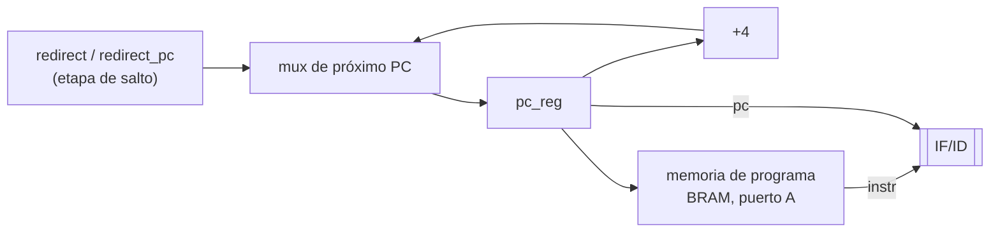
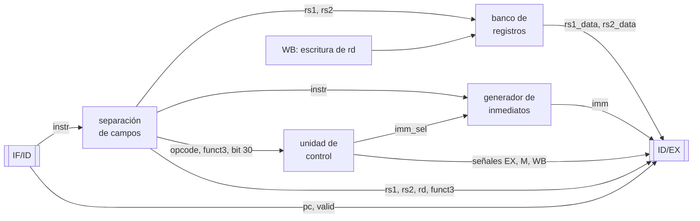
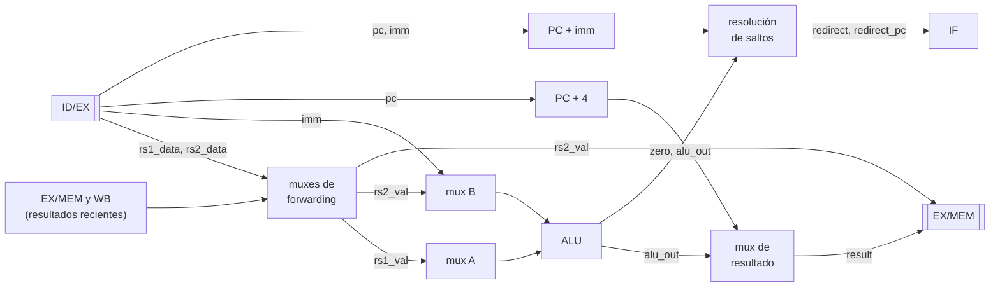
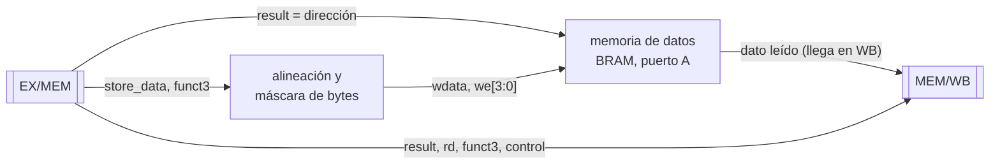
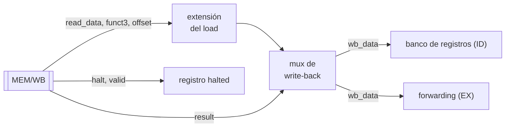

# Arquitectura del pipeline y camino de datos

> **Estado:** borrador — issue I-04 (#7). Las secciones marcadas *pendiente* se
> completan en los próximos commits de la rama `docs/7_pipeline`.

Este documento fija **qué hace cada etapa** del procesador y **qué información viaja
entre ellas**, para poder codificar `rtl/pipeline/` sin dudas sobre las interfaces.
Las instrucciones soportadas y su codificación están en [`isa.md`](isa.md).

---

## 1. Visión general

Procesador RV32I (subset de la consigna + HALT) segmentado en 5 etapas. Todo el diseño
corre en **un único dominio de reloj**: el clock nunca se detiene; parar o avanzar el
core se hace con señales de *enable* (ver `docs/diagramas/sistema.png`).

| Etapa | Qué hace | Bloques principales |
|---|---|---|
| **IF** | Mantiene el PC y lee la instrucción | registro PC, sumador `+4`, mux de próximo PC, memoria de programa |
| **ID** | Decodifica, lee registros, arma el inmediato y el control | banco de registros, generador de inmediatos, unidad de control |
| **EX** | Opera y calcula direcciones y destinos de salto | ALU, muxes de operandos, sumador de destino¹ |
| **MEM** | Lee o escribe la memoria de datos | memoria de datos, alineación y máscara de bytes |
| **WB** | Elige el valor final y lo escribe en `rd` | extensión de loads, mux de write-back |

¹ La etapa donde se resuelven los saltos se fija en I-09; este documento asume EX.

```
        ┌────┐  IF/ID  ┌────┐  ID/EX  ┌────┐  EX/MEM  ┌─────┐  MEM/WB  ┌────┐
 PC ──► │ IF │ ──██──► │ ID │ ──██──► │ EX │ ──██───► │ MEM │ ──██───► │ WB │
        └────┘         └────┘         └────┘          └─────┘          └────┘
                          ▲                                               │
                          └──────────── escritura de rd ◄─────────────────┘
```

Los bloques `██` son los **registros de segmentación** (los "latches intermedios" de la
consigna): guardan todo lo que una instrucción necesita para las etapas siguientes
mientras pasa de una etapa a otra.

---

## 2. Convenciones

### Anchos
Datos y direcciones de **32 bits**. Números de registro de 5 bits (`x0`–`x31`).

### Nombres
- Señal interna de una etapa: prefijo de la etapa (`if_`, `id_`, `ex_`, `mem_`, `wb_`).
- Campo de un registro de segmentación: prefijo del registro (`if_id_`, `id_ex_`,
  `ex_mem_`, `mem_wb_`). Ejemplo: `id_ex_rs1_data` es el valor de `rs1` que ID dejó
  guardado para EX.
- Puertos de módulo: `i_` / `o_`.

### Control de los registros de segmentación
Todos tienen las mismas tres entradas:

| Entrada | Efecto |
|---|---|
| `rst` | Carga una burbuja. |
| `en` | En 0 conserva el contenido (stall o core detenido por la Debug Unit). |
| `flush` | En 1 carga una burbuja en lugar de la instrucción entrante. |

Quién maneja `en` y `flush` se define en I-05 (riesgos), I-06 (Debug Unit) e I-09 (saltos).

### Burbujas y bit `valid`
Cada registro de segmentación lleva un bit `valid` que indica si contiene una
instrucción real. Una **burbuja** es un registro con `valid = 0` y todas las señales de
control con efectos en 0 (escritura de registro, escritura de memoria, salto y halt); sus
campos de datos no importan.

El bit `valid` permite que el dump muestre qué etapas están vacías, que "pipeline
vacío" se pueda verificar (todos los `valid` en 0) y que se pueda anular la instrucción
de IF/ID (§3.3).

---

## 3. Etapa IF — Instruction Fetch

**Qué hace:** mantiene el PC, lee la instrucción que está en esa dirección y decide cuál
es el próximo PC.



### 3.1 Próximo PC

```
si   redirect      →  pc_next = redirect_pc      (salto tomado: gana siempre)
sino stop_fetch    →  pc_next = pc_reg           (HALT en vuelo, §3.4)
sino               →  pc_next = pc_reg + 4
pc_reg <= pc_next     solo si en_pc = 1
```

| Señal | Ancho | Viene de | Significado |
|---|---|---|---|
| `redirect` | 1 | etapa de salto (I-09) | Hay que cambiar el flujo: `beq`/`bne` tomado, `jal` o `jalr`. |
| `redirect_pc` | 32 | etapa de salto (I-09) | Destino ya calculado: `PC + imm` o `(rs1 + imm) & ~1`. |
| `stop_fetch` | 1 | §3.4 | Hay un HALT en el pipeline. |
| `en_pc` | 1 | I-05 / I-06 | En 0 el PC no avanza. |

IF no necesita saber qué tipo de salto hubo: recibe la dirección ya calculada.
Valor de reset del PC: `0x0000_0000` (a confirmar en I-07).

<<<<<<< HEAD
### 3.4 Memoria de programa de lectura sincrónica
La memoria de programa es una BRAM: **entrega el dato un ciclo después** de recibir la
dirección. Se direcciona con `pc_reg`, y **su registro de salida hace de campo `instr`
del registro IF/ID**.
=======
### 3.2 Memoria de programa
BRAM de lectura sincrónica: **entrega el dato un ciclo después** de recibir la dirección.
Se direcciona con `pc_reg[AW+1:2]` (las instrucciones están alineadas a 4 bytes) y **su
registro de salida hace de campo `instr` de IF/ID**, así que no se agrega ningún ciclo
(decisión [002](../decisiones/002-memorias-sincronicas.md)):
>>>>>>> 04948fd (docs(pipeline): etapas ID, EX, MEM y WB)

```
ciclo          t            t+1           t+2
pc_reg         p            p+4           p+8
dout BRAM      (anterior)   instr(p)      instr(p+4)
if_id_pc       (anterior)   p             p+4
etapa ID       —            instr(p)      instr(p+4)
```

### 3.3 Stall, flush y reset
- **Stall:** el `ena` de la BRAM va unido al `en` de IF/ID. Con `ena = 0` la salida no
  cambia y la instrucción queda quieta.
- **Flush:** la salida de la BRAM no se puede borrar, así que el flush pone
  `if_id_valid = 0`. ID ve `valid = 0` y trata la instrucción como burbuja (§4.4).
- **Reset:** pone `if_id_valid = 0`. La basura que tiene la BRAM a la salida después de un
  reset se ignora con el mismo mecanismo.

### 3.4 Parada por HALT
Mientras haya un HALT en el pipeline, IF deja de buscar instrucciones. Así detrás del
HALT solo entran burbujas, y cuando llega a WB el pipeline queda vacío (decisión 001).

```
stop_fetch = id_is_halt | id_ex_halt | ex_mem_halt | mem_wb_halt | halted
```

> **Propuesta de ajuste a la decisión 001 (a acordar):** la versión actual congela el PC
> solo mientras el HALT está en ID. Cuando el HALT pasa a EX, la condición se apaga y se
> buscan instrucciones posteriores al HALT. La fórmula de arriba mantiene la parada
> mientras el HALT esté en cualquier etapa. Si un salto anterior lo anula, el flush lo
> convierte en burbuja y su bit desaparece solo.

### 3.5 Salidas hacia IF/ID

| Campo | Ancho | Descripción |
|---|---|---|
| `if_id_pc` | 32 | PC de la instrucción. |
| `if_id_instr` | 32 | Instrucción (salida registrada de la BRAM). |
| `if_id_valid` | 1 | 1 = instrucción real, 0 = burbuja. |

`PC + 4` no viaja: se recalcula en EX cuando hace falta (`jal`, `jalr`).

---

## 4. Etapa ID — Instruction Decode

**Qué hace:** convierte los 32 bits de la instrucción en todo lo que las etapas
siguientes necesitan para ejecutarla: los **valores** de los registros fuente, el
**inmediato** y las **señales de control**. Toda la lógica es combinacional; el resultado
se guarda en ID/EX al final del ciclo.



### 4.1 Campos de la instrucción
Cada campo ocupa siempre los mismos bits (ver [`isa.md`](isa.md)), así que se separan
con cables, sin lógica y sin saber todavía qué instrucción es.

| Campo | Bits | Para qué se usa |
|---|---|---|
| `opcode` | `[6:0]` | Unidad de control. |
| `rd` | `[11:7]` | Registro destino; viaja hasta WB. |
| `funct3` | `[14:12]` | Operación de ALU, tipo de salto, tamaño de acceso a memoria. |
| `rs1` | `[19:15]` | Primer registro fuente. |
| `rs2` | `[24:20]` | Segundo registro fuente. |
| `instr[30]` | `[30]` | Distingue `add`/`sub` y `srl`/`sra` (§4.5). |

Cuando una instrucción no usa un campo, esos bits tienen otra cosa. Por ejemplo, en
`sw` el campo `rd` son bits del inmediato. El control anula su efecto (en `sw`,
`reg_write = 0`), así que el valor de esos bits no importa.

### 4.2 Banco de registros
- 32 registros de 32 bits, implementados con flip-flops.
- `x0` vale siempre 0: leerlo devuelve 0 y escribirlo no tiene efecto.
- **Lectura:** dos puertos asíncronos (`rs1`, `rs2`); el dato está disponible en el mismo
  ciclo.
- **Escritura:** un puerto en el flanco de subida, **manejado por WB** (`wb_reg_write`,
  `wb_rd`, `wb_data`).
- **Bypass:** si en el mismo ciclo WB escribe el registro que ID está leyendo, la lectura
  entrega el dato nuevo (decisión [003](../decisiones/003-banco-registros.md)):

  ```
  id_rs1_data = (rs1 == 0)                     ? 0       :
                (wb_reg_write && wb_rd == rs1) ? wb_data :
                                                 regs[rs1]
  (ídem para rs2)
  ```
- **Tercer puerto de lectura** para el dump de la Debug Unit (interfaz en I-06).

### 4.3 Generador de inmediatos
Reconstruye el inmediato según el formato que indica `imm_sel` y lo **extiende con signo**
a 32 bits usando `instr[31]`:

| `imm_sel` | Instrucciones | Inmediato de 32 bits |
|---|---|---|
| `I` | aritméticas con inmediato, loads, `jalr` | `{{20{i[31]}}, i[31:20]}` |
| `S` | `sb`, `sh`, `sw` | `{{20{i[31]}}, i[31:25], i[11:7]}` |
| `B` | `beq`, `bne` | `{{19{i[31]}}, i[31], i[7], i[30:25], i[11:8], 1'b0}` |
| `U` | `lui` | `{i[31:12], 12'b0}` |
| `J` | `jal` | `{{11{i[31]}}, i[31], i[19:12], i[20], i[30:21], 1'b0}` |

En B y J el bit 0 es siempre 0, porque los saltos van a direcciones pares. En `sltiu` el
inmediato también se extiende con signo; la comparación sin signo se hace después, en la ALU.

### 4.4 Unidad de control
Mira `opcode` (y `funct3` e `instr[30]` para la ALU) y genera las señales de control.
Las señales se agrupan según la etapa que las usa. Cada grupo viaja por los registros de
segmentación hasta su etapa y ahí deja de viajar.

| Señal (nombre habitual) | Ancho | Qué indica | La usa |
|---|---|---|---|
| `imm_sel` | 3 | Formato del inmediato. | ID |
| `alu_ctrl` (ALU control) | 4 | Operación de la ALU (§4.5). | EX |
| `alu_src_a` | 1 | Operando A: 0 = `rs1`, 1 = cero (para `lui`). | EX |
| `alu_src_b` (ALUSrc) | 1 | Operando B: 0 = `rs2`, 1 = inmediato. | EX |
| `branch` (Branch) | 1 | Es `beq`/`bne` (el tipo lo da `funct3`). | etapa de salto |
| `jal` | 1 | Es `jal`. | etapa de salto |
| `jalr` | 1 | Es `jalr`. | etapa de salto |
| `mem_read` (MemRead) | 1 | Es un load. La detección de load-use (I-05) la lee en ID/EX. | ID/EX |
| `mem_write` (MemWrite) | 1 | Escribe memoria. | MEM |
| `reg_write` (RegWrite) | 1 | Escribe `rd`. También lo usa el forwarding (I-05). | WB |
| `mem_to_reg` (MemtoReg) | 1 | Qué se escribe en `rd`: 0 = resultado de EX, 1 = dato de memoria. | WB |
| `halt` | 1 | Es HALT. | IF y WB |

**Tabla de verdad** (`x` = no importa, se implementa como 0):

| Instrucción | Opcode | `imm_sel` | `alu_src_a` | `alu_src_b` | `alu_ctrl` | `branch` | `jal` | `jalr` | `mem_read` | `mem_write` | `reg_write` | `mem_to_reg` | `halt` |
|---|---|---|---|---|---|---|---|---|---|---|---|---|---|
| R-type | `0110011` | x | 0 | 0 | §4.5 | 0 | 0 | 0 | 0 | 0 | 1 | 0 | 0 |
| I aritmética | `0010011` | I | 0 | 1 | §4.5 | 0 | 0 | 0 | 0 | 0 | 1 | 0 | 0 |
| Load | `0000011` | I | 0 | 1 | ADD | 0 | 0 | 0 | 1 | 0 | 1 | 1 | 0 |
| Store | `0100011` | S | 0 | 1 | ADD | 0 | 0 | 0 | 0 | 1 | 0 | x | 0 |
| Branch | `1100011` | B | 0 | 0 | SUB | 1 | 0 | 0 | 0 | 0 | 0 | x | 0 |
| `jal` | `1101111` | J | x | x | x | 0 | 1 | 0 | 0 | 0 | 1 | 0 | 0 |
| `jalr` | `1100111` | I | 0 | 1 | ADD | 0 | 0 | 1 | 0 | 0 | 1 | 0 | 0 |
| `lui` | `0110111` | U | 1 | 1 | ADD | 0 | 0 | 0 | 0 | 0 | 1 | 0 | 0 |
| HALT | palabra `0x0010_0073` | x | x | x | x | 0 | 0 | 0 | 0 | 0 | 0 | x | 1 |
| No reconocida | — | x | x | x | x | 0 | 0 | 0 | 0 | 0 | 0 | x | 0 |
| Burbuja (`valid = 0`) | — | x | x | x | x | 0 | 0 | 0 | 0 | 0 | 0 | x | 0 |

- `jal` y `jalr` escriben `PC + 4` en `rd`. Ese valor sale de EX como resultado, por eso
  `mem_to_reg = 0`.
- `lui` calcula `0 + inmediato`: `alu_src_a = 1` pone un cero en el operando A.
- Una instrucción **no reconocida** (por ejemplo `0x0000_0000` o `ecall`) no tiene ningún
  efecto: se comporta como NOP.
- `halt` solo se activa si `if_id_valid = 1`, para que la basura que queda después de un
  reset no se confunda con un HALT.

### 4.5 Control de la ALU
La operación de la ALU se decide completa en ID. A EX solo viajan los 4 bits de
`alu_ctrl`, y el código es `{instr[30], funct3}`:

| Operación | `alu_ctrl` | Instrucciones |
|---|---|---|
| ADD | `0000` | `add`, `addi`, loads, stores, `jalr`, `lui` |
| SUB | `1000` | `sub`, `beq`, `bne` |
| SLL | `0001` | `sll`, `slli` |
| SLT | `0010` | `slt`, `slti` |
| SLTU | `0011` | `sltu`, `sltiu` |
| XOR | `0100` | `xor`, `xori` |
| SRL | `0101` | `srl`, `srli` |
| SRA | `1101` | `sra`, `srai` |
| OR | `0110` | `or`, `ori` |
| AND | `0111` | `and`, `andi` |

Reglas por tipo:

```
R-type:        alu_ctrl = { instr[30], funct3 }
I aritmética:  alu_ctrl = { (funct3 == 3'b101) ? instr[30] : 1'b0, funct3 }
resto:         ADD o SUB según la tabla de verdad
```

En las I aritméticas, `instr[30]` es un bit del inmediato. Solo se usa en `srli`/`srai`
(`funct3 = 101`), donde efectivamente distingue una de la otra. Si se tomara siempre, un
`addi` con inmediato negativo se ejecutaría como resta.

### 4.6 Salidas hacia ID/EX

| Campo | Ancho | Descripción |
|---|---|---|
| `id_ex_valid` | 1 | 1 = instrucción real, 0 = burbuja. |
| `id_ex_pc` | 32 | PC de la instrucción. |
| `id_ex_rs1_data` | 32 | Valor de `rs1`. |
| `id_ex_rs2_data` | 32 | Valor de `rs2` (operando B o dato del store). |
| `id_ex_imm` | 32 | Inmediato extendido. |
| `id_ex_rs1`, `id_ex_rs2` | 5 + 5 | Números de registro fuente (forwarding, I-05). |
| `id_ex_rd` | 5 | Registro destino. |
| `id_ex_funct3` | 3 | Tipo de salto; tamaño y signo del acceso a memoria. |
| `alu_ctrl`, `alu_src_a`, `alu_src_b` | 4 + 1 + 1 | Control de EX. |
| `branch`, `jal`, `jalr` | 3 | Control de salto. |
| `mem_read`, `mem_write` | 2 | Control de MEM. |
| `reg_write`, `mem_to_reg` | 2 | Control de WB. |
| `id_ex_halt` | 1 | HALT en vuelo. |
| **Total** | **161** | |

---

## 5. Etapa EX — Execute

**Qué hace:** ejecuta la orden que armó ID: elige los operandos, opera en la ALU,
resuelve los saltos y deja listo el resultado de la instrucción.



### 5.1 Selección de operandos
Primero, el **forwarding**: el valor de `rs1` o `rs2` que se leyó en ID puede estar viejo,
porque una instrucción anterior que todavía no llegó a WB lo está modificando. Cada
operando pasa por un mux de tres entradas:

| Entrada | Valor | Cuándo se usa |
|---|---|---|
| 0 | `id_ex_rs1_data` / `id_ex_rs2_data` | Caso normal: el valor leído en ID es el correcto. |
| 1 | `ex_mem_result` | La instrucción anterior (ahora en MEM) escribe ese registro. |
| 2 | `wb_data` | La instrucción de hace dos (ahora en WB) escribe ese registro. |

Los selectores los genera la unidad de forwarding (I-05). A la salida de estos muxes
están `rs1_val` y `rs2_val`, los valores **correctos** de los registros fuente.

Después, los operandos de la ALU:

```
alu_a = alu_src_a ? 0   : rs1_val
alu_b = alu_src_b ? imm : rs2_val
```

### 5.2 ALU
ALU de 32 bits con las 10 operaciones de §4.5, seleccionadas por `alu_ctrl`.
Salidas: `alu_out` (resultado) y `zero` (1 si `alu_out == 0`). En los desplazamientos
usa solo `alu_b[4:0]`.

### 5.3 Resolución de saltos
Hay un sumador dedicado para `PC + imm`; la ALU queda libre para comparar o calcular
`rs1 + imm`.

```
taken       = branch & (zero ^ funct3[0])        beq: salta si zero = 1
                                                 bne: salta si zero = 0
redirect    = taken | jal | jalr
redirect_pc = jalr ? {alu_out[31:1], 1'b0}       (rs1 + imm, con el bit 0 en cero)
                   : pc + imm                    (branch y jal)
```

- La ALU compara con una resta: `beq` salta si `rs1 - rs2 = 0`.
- Cuando `redirect = 1`, IF y ID contienen instrucciones que se buscaron siguiendo
  `PC + 4` y no deben ejecutarse: se hace flush de IF/ID y de ID/EX. Un salto tomado
  cuesta 2 ciclos. La etapa de resolución y su costo se revisan en I-09.

### 5.4 Resultado
```
result = (jal | jalr) ? pc + 4 : alu_out
```
Para `jal` y `jalr`, el valor a guardar en `rd` es la dirección de retorno (`PC + 4`).
Para el resto es la salida de la ALU; en loads y stores esa salida es la dirección de
memoria.

### 5.5 Salidas hacia EX/MEM

| Campo | Ancho | Descripción |
|---|---|---|
| `ex_mem_valid` | 1 | 1 = instrucción real, 0 = burbuja. |
| `ex_mem_pc` | 32 | PC de la instrucción (identifica la etapa en el dump). |
| `ex_mem_result` | 32 | Resultado de EX; en loads y stores, la dirección. |
| `ex_mem_store_data` | 32 | Dato a guardar (`rs2_val`, ya con forwarding). |
| `ex_mem_rd` | 5 | Registro destino. |
| `ex_mem_funct3` | 3 | Tamaño y signo del acceso a memoria. |
| `mem_write` | 1 | Control de MEM. |
| `reg_write`, `mem_to_reg` | 2 | Control de WB. |
| `ex_mem_halt` | 1 | HALT en vuelo. |
| **Total** | **109** | |

> **Nota de tiempo.** El camino más largo del diseño probablemente pase por EX: dato
> reenviado desde WB → mux de forwarding → ALU → decisión de salto → mux de próximo PC.
> Es el primer candidato a revisar en el análisis de tiempo.

---

## 6. Etapa MEM — Memory Access

**Qué hace:** en un store escribe la memoria de datos; en un load entrega la dirección
para que el dato llegue en el ciclo siguiente. El resto de las instrucciones atraviesan
MEM sin hacer nada.



### 6.1 Dirección
La memoria está organizada en palabras de 32 bits, pero se direcciona por byte:

```
índice de palabra = result[AW+1:2]
byte dentro de la palabra (offset) = result[1:0]
```

### 6.2 Escritura (stores)
Un store puede escribir 1, 2 o 4 bytes de la palabra. La BRAM tiene un *write enable*
por byte (`we[3:0]`): solo se escriben los bytes con su bit en 1.

| Instrucción | `funct3` | `wdata` | `we[3:0]` |
|---|---|---|---|
| `sb` | `000` | `{4{d[7:0]}}` | `0001 << offset` |
| `sh` | `001` | `{2{d[15:0]}}` | `0011 << {offset[1], 0}` |
| `sw` | `010` | `d` | `1111` |

`d` es `ex_mem_store_data`. El dato se **repite** en todas las posiciones de la palabra y la
máscara elige cuál se escribe. Así no hace falta un desplazador. Ejemplo: `sb` en una
dirección con `offset = 2` pone el byte en los cuatro lugares y escribe solo con
`we = 0100`, es decir, en los bits `[23:16]`. Si `mem_write = 0`, `we = 0000`.

### 6.3 Lectura (loads)
La BRAM se lee siempre con la dirección de `ex_mem_result`, y la palabra completa aparece
**en el ciclo siguiente**: su registro de salida hace de campo `mem_wb_read_data`
(decisión [002](../decisiones/002-memorias-sincronicas.md)). Seleccionar el byte o la
media palabra y extenderla se hace en WB (§7.1). El `ena` de la BRAM va unido al `en`
de MEM/WB, para que con el core detenido el dato leído no cambie.

### 6.4 Accesos desalineados
No se soportan. El hardware ignora los bits bajos que no corresponden al tamaño: un `lw`
o `sw` ignora `offset` y un `lh`/`sh` ignora `offset[0]`. Cualquier acceso cae así en la
palabra o media palabra alineada que lo contiene. La política queda documentada en I-07.

### 6.5 Salidas hacia MEM/WB

| Campo | Ancho | Descripción |
|---|---|---|
| `mem_wb_valid` | 1 | 1 = instrucción real, 0 = burbuja. |
| `mem_wb_pc` | 32 | PC de la instrucción (identifica la etapa en el dump). |
| `mem_wb_result` | 32 | Resultado de EX (para todo lo que no es load). |
| `mem_wb_read_data` | 32 | Palabra leída. Es la salida registrada de la BRAM, no un flip-flop aparte. |
| `mem_wb_rd` | 5 | Registro destino. |
| `mem_wb_funct3` | 3 | Tamaño y signo del load. |
| `mem_wb_offset` | 2 | Byte dentro de la palabra (`result[1:0]`). |
| `reg_write`, `mem_to_reg` | 2 | Control de WB. |
| `mem_wb_halt` | 1 | HALT en vuelo. |
| **Total** | **110** | (78 en flip-flops + 32 de la BRAM) |

---

## 7. Etapa WB — Write Back

**Qué hace:** arma el valor final de la instrucción y lo escribe en `rd`. Ese mismo valor
se reenvía a EX (forwarding).



### 7.1 Extensión del load
Del dato leído se toma la parte que corresponde y se extiende a 32 bits:

```
byte = read_data >> (8 * offset)       [7:0]
half = read_data >> (16 * offset[1])   [15:0]
```

| Instrucción | `funct3` | Valor |
|---|---|---|
| `lb` | `000` | `byte` extendido con signo |
| `lh` | `001` | `half` extendido con signo |
| `lw` | `010` | `read_data` |
| `lbu` | `100` | `byte` extendido con ceros |
| `lhu` | `101` | `half` extendido con ceros |

### 7.2 Valor final y escritura

```
wb_data      = mem_to_reg ? valor_del_load : mem_wb_result
wb_reg_write = mem_wb_reg_write
wb_rd        = mem_wb_rd
```

Estas tres señales van al puerto de escritura del banco de registros, en ID (§4.2).
`wb_data` también es la entrada 2 de los muxes de forwarding de EX (§5.1).

### 7.3 Registro `halted`
Cuando un HALT llega a WB, ya no puede ser anulado por ningún salto. En ese momento se
activa `halted`, que queda en 1 hasta el próximo reset (decisión 001):

```
si (mem_wb_valid & mem_wb_halt)  →  halted <= 1
```

Detrás del HALT solo entraron burbujas (§3.4), así que un ciclo después todos los
`valid` están en 0: el pipeline está vacío. `halted` es la señal que la Debug Unit mira
para saber que terminó la ejecución (I-06).

## 8. Registros de segmentación

*Pendiente: tabla completa de IF/ID, ID/EX, EX/MEM y MEM/WB.*

## 9. Señales de control

<<<<<<< HEAD
*Pendiente: lista con la etapa de origen y la de consumo de cada señal.*
=======
*Pendiente: lista con la etapa de origen y la de consumo de cada señal.*
>>>>>>> 04948fd (docs(pipeline): etapas ID, EX, MEM y WB)
