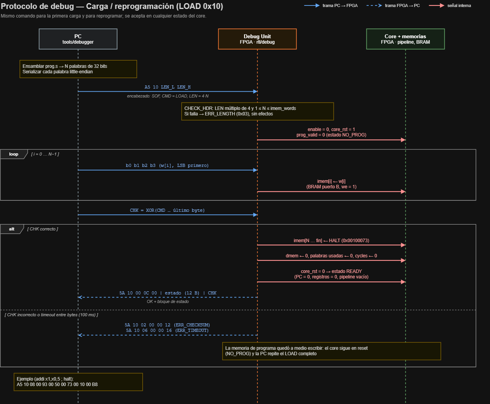
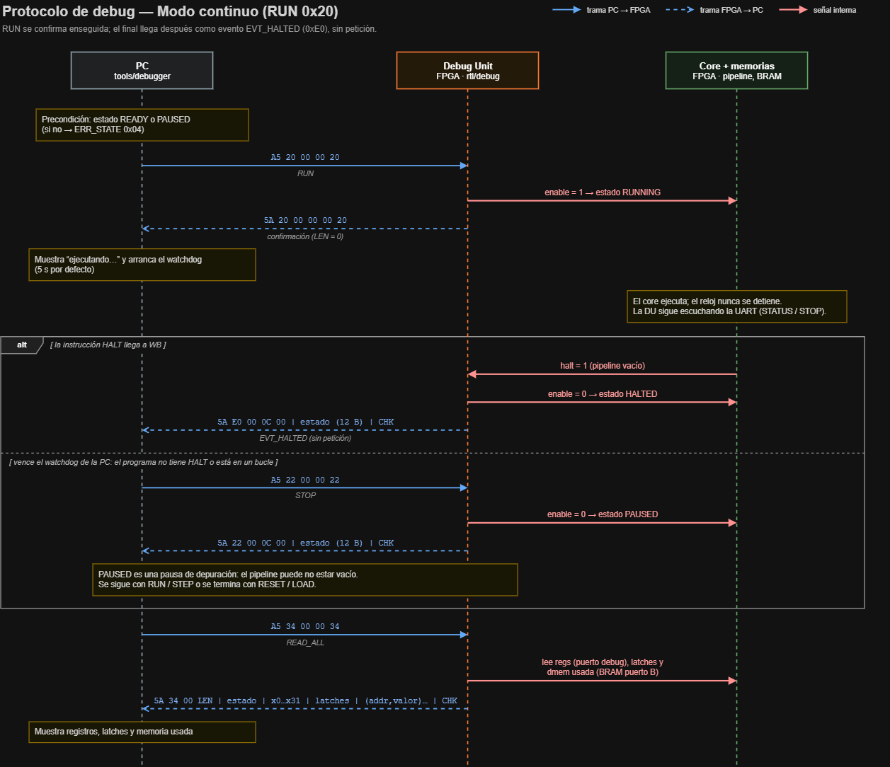
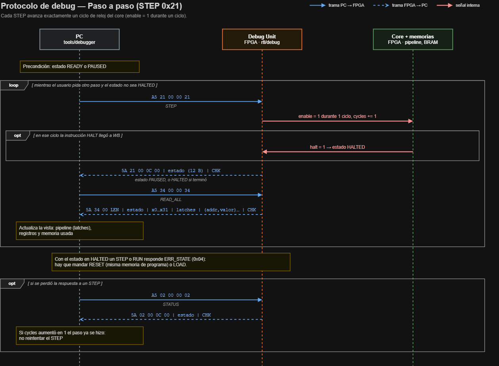
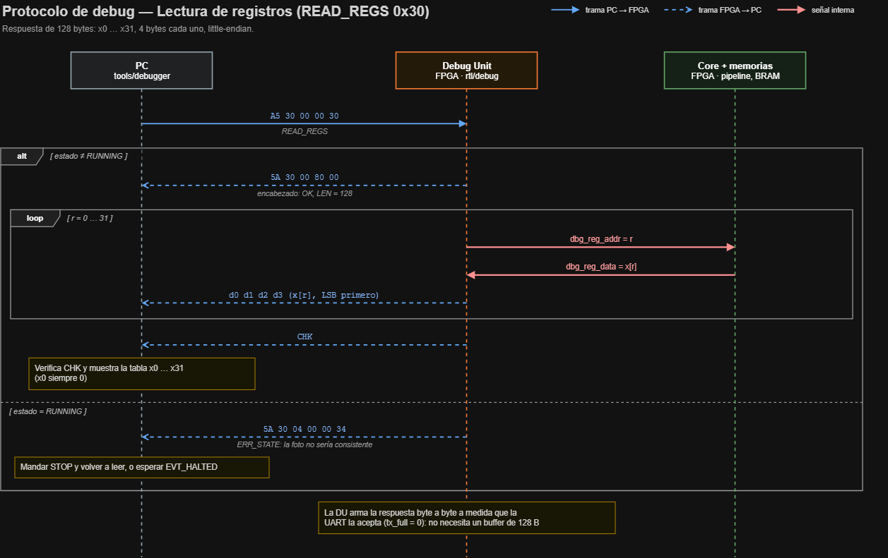
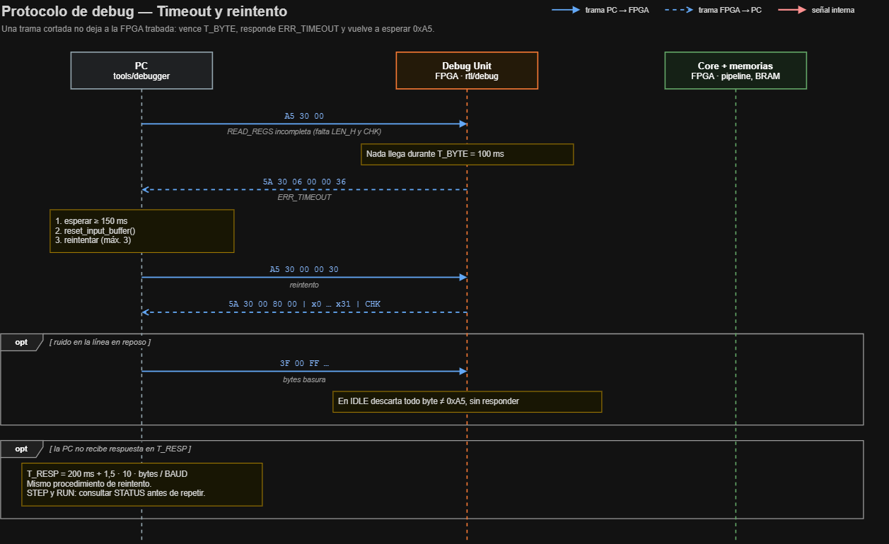
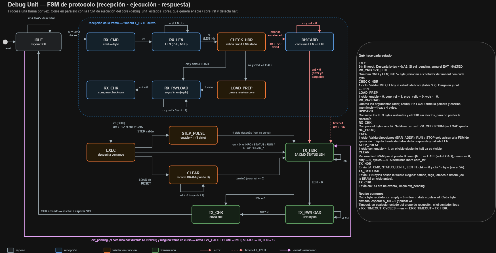
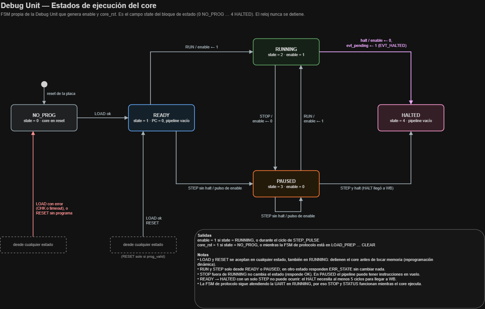

# Protocolo de la Debug Unit

Contrato entre la FPGA (Debug Unit) y el software de la PC (`tools/debugger/`). Si un PR
cambia algo de este documento, tiene que cambiar el RTL y el cliente de la PC en el mismo PR.

| | |
|---|---|
| **Versión del protocolo** | 1 (la devuelve el comando `INFO`) |
| **Estado** | Propuesta, pendiente de revisión |
| **Depende de** | [`isa.md`](isa.md) (codificación del HALT), `memoria.md` (tamaños), `pipeline.md` (contenido de los latches) |
| **Diagramas** | [`sistema`](../diagramas/sistema.png), secuencias `protocolo_*.png`, FSM `debug_unit_*.png` |

## 1. Capa física: UART

| Parámetro | Valor | Nota |
|---|---|---|
| Baudrate | **115200** | Parámetro `BAUD` del top. Alternativa validada en TP2: 19200 |
| Bits de datos | 8 | `NB_DATA = 8` |
| Paridad | ninguna | La integridad la cubre el checksum de la trama |
| Stop bits | 1 | `SB_TICK = 16` |
| Orden de bits | LSB primero | Estándar UART, ya implementado en `uart_rx`/`uart_tx` |
| Control de flujo | ninguno | Ni RTS/CTS ni XON/XOFF |
| Sobremuestreo | 16× | `baud_gen` genera un tick de 16× el baudrate |

Configuración abreviada: **115200 8N1**. En pyserial:
`serial.Serial(port, 115200, bytesize=8, parity='N', stopbits=1, timeout=...)`.

### Divisor del baud generator

`DVSR = round(f_clk / (16 × BAUD))`. Tiene que calcularse en el top a partir de un parámetro
`CLK_FREQ_HZ`, no escribirse a mano, porque la frecuencia va a cambiar cuando se aplique el
Clock Wizard (ver `docs/timing/`).

| `f_clk` | `DVSR` | Baudrate real | Error |
|---|---|---|---|
| 100 MHz (Basys 3 sin Clock Wizard) | 54 | 115 741 | +0,47 % |
| 80 MHz | 43 | 116 279 | +0,94 % |
| 75 MHz | 41 | 114 329 | −0,76 % |
| 50 MHz | 27 | 115 741 | +0,47 % |

Un error menor al 2 % es seguro para 8N1.

> **Error en el TP2:** `fpga/tp2_uart/top.v` usa `DVSR = 326` y el comentario dice
> "50 MHz, 9600 baud", pero la Basys 3 tiene 100 MHz: 100 MHz / (16 × 326) ≈ **19 172 baud**,
> es decir, 19200, que coincide con `serial_comm.py`. Conviene corregir ese comentario.

### Por qué 115200 y no 19200

El modo paso a paso manda un volcado completo en cada paso: estado (12 B) + 32 registros
(128 B) + latches (~60 B) + memoria de datos usada (8 B por palabra). Con 20 palabras usadas
son unos 360 bytes: **~31 ms a 115200** frente a **~190 ms a 19200**. A 19200 el paso a paso
se siente lento y cargar un programa de 1 K palabras tarda más de 2 s. El chip USB-UART de la
Basys 3 (FT2232) soporta 115200 sin problemas. Si en la placa aparecen errores, se vuelve a
19200 cambiando solo el parámetro `BAUD` y la configuración del cliente.

### Interfaz con la UART existente

La Debug Unit se conecta a `intf_circ` igual que `alu_top` en el TP2:

| Señal | Dirección | Uso en la Debug Unit |
|---|---|---|
| `r_data[7:0]`, `rx_empty` | UART → DU | Hay byte disponible cuando `rx_empty = 0` |
| `rd` | DU → UART | Pulso de un ciclo después de leer `r_data` |
| `w_data[7:0]`, `wr` | DU → UART | Escribe un byte para transmitir |
| `tx_full` | UART → DU | La DU solo escribe con `tx_full = 0` |

`flag_buff` guarda un solo byte. No es un problema: a 115200 llega un byte cada ~87 µs
(~8700 ciclos a 100 MHz) y la Debug Unit consume cada byte en pocos ciclos.

## 2. Formato de las tramas

Todos los campos de más de un byte son **little-endian** (byte menos significativo primero),
igual que RISC-V. Una palabra de 32 bits `0x00500093` viaja como `93 00 50 00`.

### Petición (PC → FPGA)

```
+------+-----+-------+-------+-----------------+-----+
| SOF  | CMD | LEN_L | LEN_H | PAYLOAD (LEN B) | CHK |
| 0xA5 | 1 B |    LEN: 2 B  |                 | 1 B |
+------+-----+-------+-------+-----------------+-----+
```

### Respuesta y evento (FPGA → PC)

```
+------+-----+--------+-------+-------+-----------------+-----+
| SOF  | CMD | STATUS | LEN_L | LEN_H | PAYLOAD (LEN B) | CHK |
| 0x5A | 1 B |  1 B   |    LEN: 2 B   |                 | 1 B |
+------+-----+--------+-------+-------+-----------------+-----+
```

| Campo | Descripción |
|---|---|
| `SOF` | Inicio de trama. `0xA5` en peticiones y `0x5A` en respuestas, así en una captura se distingue la dirección |
| `CMD` | Código de comando (sección 3). La respuesta repite el `CMD` de la petición; los eventos usan `0xE0` |
| `STATUS` | Solo en respuestas: `0x00` = OK, otro valor = error (sección 5) |
| `LEN` | Cantidad de bytes del `PAYLOAD` (0 a 65 535). No cuenta `SOF`, `CMD`, `STATUS`, `LEN` ni `CHK` |
| `PAYLOAD` | Depende del comando |
| `CHK` | XOR de todos los bytes desde `CMD` hasta el último byte del `PAYLOAD` (incluye `STATUS` y `LEN`, excluye `SOF`) |

Reglas:

- Toda petición recibe **exactamente una respuesta**, con el mismo `CMD`.
- La FPGA nunca intercala tramas: si hay un evento pendiente, se envía después de terminar la
  respuesta en curso.
- En estado de reposo la Debug Unit **descarta sin responder** todo byte distinto de `0xA5`.
  Así se resincroniza sola después de ruido en la línea o de una trama cortada.
- Una respuesta con error tiene `LEN = 0`.

### Checksum

```python
from functools import reduce
chk = reduce(lambda a, b: a ^ b, frame_bytes_without_sof, 0)
```

En hardware es un registro de 8 bits que se inicializa en 0 al recibir el `SOF` y hace
`chk <= chk ^ byte` con cada byte. Se eligió XOR y no CRC-8 porque es trivial en ambos lados y
se puede verificar a mano en una captura; detecta todo error de un bit (el caso típico en una
UART), pero no detecta dos errores en la misma posición de bit ni bytes permutados. Si en la
práctica aparecen errores que pasan el checksum, se reemplaza por CRC-8 sin cambiar el resto
de la trama.

## 3. Comandos

| `CMD` | Nombre | Payload de la petición | Payload de la respuesta (OK) |
|---|---|---|---|
| `0x01` | `INFO` | — | Bloque de información (13 B) |
| `0x02` | `STATUS` | — | Bloque de estado (12 B) |
| `0x10` | `LOAD` | N palabras de instrucción (4N B) | Bloque de estado |
| `0x11` | `RESET` | — | Bloque de estado |
| `0x20` | `RUN` | — | — (`LEN = 0`) |
| `0x21` | `STEP` | — | Bloque de estado |
| `0x22` | `STOP` | — | Bloque de estado |
| `0x30` | `READ_REGS` | — | 32 registros (128 B) |
| `0x31` | `READ_LATCHES` | — | Latches IF/ID, ID/EX, EX/MEM, MEM/WB |
| `0x32` | `READ_DMEM` | `addr` (4 B) + `count` (2 B) | `count` palabras (4·`count` B) |
| `0x33` | `READ_DMEM_USED` | — | Pares (`addr`, `valor`) de la memoria usada |
| `0x34` | `READ_ALL` | — | Estado + registros + latches + memoria usada |
| `0xE0` | `EVT_HALTED` | *(solo FPGA → PC)* | Bloque de estado |

Correspondencia con lo que pide la issue:

| Requisito | Comando |
|---|---|
| Cargar programa | `LOAD` |
| Ejecución continua | `RUN` (+ `EVT_HALTED` al terminar; `STOP` si no hay HALT) |
| Un paso | `STEP` |
| Leer los 32 registros | `READ_REGS` |
| Leer latches intermedios | `READ_LATCHES` |
| Leer memoria de datos | `READ_DMEM` (rango) y `READ_DMEM_USED` (solo la usada, como pide la consigna) |
| Reprogramar | `LOAD` sobre un programa ya cargado, en cualquier estado (ver 3.3) |

### 3.1 Bloque de estado (12 bytes)

Lo devuelven `STATUS`, `LOAD`, `RESET`, `STEP`, `STOP`, `EVT_HALTED` y es el comienzo de
`READ_ALL`.

| Offset | Tamaño | Campo | Contenido |
|---|---|---|---|
| 0 | 1 | `state` | Estado de ejecución: 0 `NO_PROG`, 1 `READY`, 2 `RUNNING`, 3 `PAUSED`, 4 `HALTED` |
| 1 | 1 | `flags` | bit 0 `prog_valid`, bit 1 `halted` (HALT llegó a WB), bits 7:2 en 0 |
| 2 | 2 | `dmem_used` | Palabras de la memoria de datos escritas desde el último `RESET`/`LOAD` |
| 4 | 4 | `pc` | Valor del PC (dirección que busca IF en el próximo ciclo) |
| 8 | 4 | `cycles` | Ciclos ejecutados (con `enable = 1`) desde el último `RESET`/`LOAD` |

### 3.2 Bloque de información (13 bytes) — `INFO`

| Offset | Tamaño | Campo |
|---|---|---|
| 0 | 1 | `proto_version` (= 1) |
| 1 | 2 | `imem_words`: tamaño de la memoria de programa en palabras |
| 3 | 2 | `dmem_words`: tamaño de la memoria de datos en palabras |
| 5 | 4 | Palabras de cada latch, un byte por latch: IF/ID, ID/EX, EX/MEM, MEM/WB |
| 9 | 4 | `clk_khz`: frecuencia del core en kHz (para pasar ciclos a tiempo) |

La PC manda `INFO` al conectarse. Con eso valida la versión, sabe el tamaño máximo de un
programa y cómo partir los latches. Así el cliente no tiene constantes duplicadas del RTL.

### 3.3 `LOAD` (cargar y reprogramar)

- **Payload:** N palabras de instrucción, cada una little-endian, a partir de la dirección 0.
  `LEN = 4N`.
- **Validación del encabezado:** `LEN` múltiplo de 4 y `1 ≤ N ≤ imem_words`. Si falla,
  responde `ERR_LENGTH` y **no toca nada** (el core sigue como estaba).
- **Permitido en cualquier estado**, incluso `RUNNING`: eso es la reprogramación dinámica.

Qué hace, en orden:

1. Al aceptar el encabezado: `enable = 0`, `core_rst = 1`, `prog_valid = 0`.
2. Por cada 4 bytes recibidos escribe `imem[i]` por el puerto B de la BRAM.
3. Al recibir el `CHK`:
   - **Correcto:** llena `imem[N .. imem_words−1]` con HALT (`0x00100073`), pone en cero la
     memoria de datos y el mapa de palabras usadas, pone `cycles = 0` y libera `core_rst`
     (el reset ya dejó registros en 0, PC en 0 y el pipeline vacío). Estado `READY`, responde
     OK con el bloque de estado.
   - **Incorrecto o timeout:** queda `prog_valid = 0`, estado `NO_PROG` con el core en reset,
     y responde `ERR_CHECKSUM` o `ERR_TIMEOUT`. La PC tiene que repetir el `LOAD` completo.

Cómo responde esto a las preguntas de la consigna (la respuesta completa va en
`docs/decisiones/preguntas_consigna.md`):

| Pregunta | Qué hace `LOAD` | Por qué |
|---|---|---|
| ¿Vaciar la memoria de datos? | Sí, a cero | Cada ejecución arranca igual, y "memoria usada" solo muestra lo que escribió el programa nuevo |
| ¿Y los registros? | Sí, a cero | Si no, el programa nuevo lee valores del anterior y el resultado depende del historial |
| ¿Vaciar el pipeline? | Sí (reset/flush) | Las instrucciones del programa viejo que estaban en vuelo se completarían y escribirían registros o memoria |
| ¿Y la memoria de programa? | Se sobrescribe; el resto se llena con HALT | Sin eso, si el programa nuevo es más corto, al terminar ejecutaría la cola del programa viejo |

> **Decisión a revisar:** llenar el resto con HALT cambia la respuesta a "¿qué pasa si no hay
> instrucción de parada?" de la nota del HALT: el core ya no puede salirse del programa, pero
> un bucle infinito sigue sin terminar nunca y para eso está `STOP`. Si se acepta, actualizar
> la nota de decisión del HALT.

Llenar y limpiar las memorias recorre cada BRAM una vez por el puerto B (un ciclo por palabra):
con 1 K palabras son ~10 µs, despreciable frente a la UART.

### 3.4 `RESET`

Igual que el paso 3 de un `LOAD` correcto pero sin tocar la memoria de programa: detiene el
core, limpia pipeline, registros, memoria de datos, mapa de usadas y `cycles`, y lleva el PC a 0.
Sirve para volver a correr el mismo programa. Queda en `READY` si había programa, o en
`NO_PROG` si no.

### 3.5 `RUN`, `STEP` y `STOP`

- **`RUN`**: `enable = 1` hasta que el core levante `halt` (HALT llegó a WB, pipeline vacío).
  Responde enseguida con `LEN = 0` (confirmación) y, cuando el core se detiene, la FPGA envía
  **sin petición** un `EVT_HALTED` con el bloque de estado. Mientras dura `RUNNING` solo se
  aceptan `STATUS`, `STOP`, `LOAD` y `RESET`.
- **`STEP`**: `enable = 1` durante **un ciclo de reloj** (lo que pide la consigna: un comando,
  un ciclo). Responde con el bloque de estado después de ese ciclo. Si en ese ciclo el HALT
  llegó a WB, el estado pasa a `HALTED` (no se envía `EVT_HALTED`; ya lo dice la respuesta).
- **`STOP`**: `enable = 0`. Desde `RUNNING` pasa a `PAUSED`. En otros estados no hace nada y
  responde OK con el estado (es idempotente). Existe para los programas que no terminan
  (bucle sin HALT). En `PAUSED` **el pipeline puede no estar vacío**: es una pausa de
  depuración, no el final de la ejecución. Se puede seguir con `RUN`/`STEP` o terminar con
  `RESET`/`LOAD`.

El reloj nunca se detiene: parar y avanzar el core es siempre con `enable`.

### 3.6 Lecturas

Todas requieren que el core **no esté en `RUNNING`** (si no, la foto no sería consistente).

- **`READ_REGS`**: `x0 … x31`, 4 bytes cada uno, en orden. `LEN = 128`.
- **`READ_LATCHES`**: los cuatro registros de segmentación en orden IF/ID, ID/EX, EX/MEM,
  MEM/WB. Cada uno se envía como una secuencia de palabras de 32 bits (campos empaquetados y
  rellenados con ceros). El protocolo fija el orden, la granularidad y el endianness; **qué
  campo va en cada bit lo define `pipeline.md`**, y la cantidad de palabras la informa `INFO`.
  Propuesta inicial, para ajustar cuando se cierre `pipeline.md`:

  | Latch | Palabras | Contenido propuesto |
  |---|---|---|
  | IF/ID | 2 | `pc`, `instr` |
  | ID/EX | 6 | `pc`, `rs1_data`, `rs2_data`, `imm`, `{rs1, rs2, rd, funct3, funct7[5]}`, señales de control |
  | EX/MEM | 4 | `alu_result`, `rs2_data` (dato del store), `pc+4`, `{rd, funct3, control}` |
  | MEM/WB | 3 | `mem_rdata`, `alu_result`/`pc+4`, `{rd, control}` |

  Conviene que cada latch incluya un bit `valid` (burbuja o no) en su palabra de control: la
  interfaz lo necesita para dibujar el pipeline.
- **`READ_DMEM`**: payload `addr` (4 B, dirección en bytes, alineada a palabra) y `count`
  (2 B, palabras). Responde `count` palabras. Si `addr` no está alineada, `count = 0` o el
  rango se sale de la memoria: `ERR_ADDR`.
- **`READ_DMEM_USED`**: "la memoria de datos usada" que pide la consigna. La Debug Unit
  mantiene un bit por palabra que se pone en 1 cuando el core escribe esa palabra (cualquier
  `sb`/`sh`/`sw`) y un contador `dmem_used` de palabras marcadas. Responde `dmem_used` pares
  `addr` (4 B) + `valor` (4 B) en orden creciente de dirección. `LEN = 8 × dmem_used`.
- **`READ_ALL`**: bloque de estado (12 B) + registros (128 B) + latches (4·L B) + pares de la
  memoria usada (8·`dmem_used` B). Se puede partir sin ambigüedad porque `dmem_used` viene en
  el propio bloque de estado. Es lo que usa la PC después de cada `STEP` y al recibir
  `EVT_HALTED`, con un solo ida y vuelta.

### 3.7 Comandos permitidos por estado

| Comando | `NO_PROG` | `READY` | `RUNNING` | `PAUSED` | `HALTED` |
|---|---|---|---|---|---|
| `INFO`, `STATUS` | ✓ | ✓ | ✓ | ✓ | ✓ |
| `LOAD`, `RESET` | ✓ | ✓ | ✓ | ✓ | ✓ |
| `RUN` | ✗ | ✓ | ✗ | ✓ | ✗ |
| `STEP` | ✗ | ✓ | ✗ | ✓ | ✗ |
| `STOP` | ✓ (no-op) | ✓ (no-op) | ✓ | ✓ (no-op) | ✓ (no-op) |
| `READ_*` | ✓ | ✓ | ✗ | ✓ | ✓ |

✗ = responde `ERR_STATE` sin efectos. Desde `HALTED` se vuelve a ejecutar con `RESET` o
`LOAD`. Las transiciones están en [`debug_unit_estados_core`](../diagramas/debug_unit_estados_core.png).

## 4. Ejemplos de tramas

Programa de dos instrucciones: `addi x1, x0, 5` (`0x00500093`) y `halt` (`0x00100073`).

| Qué | Bytes |
|---|---|
| `LOAD` (PC → FPGA) | `A5 10 08 00  93 00 50 00  73 00 10 00  B8` |
| Respuesta OK | `5A 10 00 0C 00  01 01 00 00  00 00 00 00  00 00 00 00  1C` |
| `RUN` | `A5 20 00 00 20` |
| Confirmación de `RUN` | `5A 20 00 00 00 20` |
| `EVT_HALTED` (HALTED, 0 palabras usadas, PC = 0x08, 6 ciclos)¹ | `5A E0 00 0C 00  04 03 00 00  08 00 00 00  06 00 00 00  E5` |
| `STEP` | `A5 21 00 00 21` |
| `READ_REGS` | `A5 30 00 00 30` |
| `READ_REGS` en `RUNNING` (error) | `5A 30 04 00 00 34` |
| `READ_DMEM` de 4 palabras desde `0x10` | `A5 32 06 00  10 00 00 00  04 00  20` |
| `LOAD` con checksum mal | `5A 10 02 00 00 12` |

Sin payload, el `CHK` de una petición es igual al `CMD` (por ejemplo `A5 20 00 00 20`).
Estas tramas sirven de casos de prueba para el testbench de la Debug Unit y para los tests
del cliente de la PC.

¹ El HALT se busca en el ciclo 2 y llega a WB en el ciclo 6. El valor exacto del PC y de
`cycles` depende de en qué etapa se congela la búsqueda (decisión del HALT y `pipeline.md`);
recalcular este ejemplo cuando esté cerrado.

## 5. Errores y timeouts

### Códigos de `STATUS`

| Código | Nombre | Cuándo | Efecto en el core |
|---|---|---|---|
| `0x00` | `OK` | — | — |
| `0x01` | `ERR_UNKNOWN_CMD` | `CMD` no está en la tabla | Ninguno |
| `0x02` | `ERR_CHECKSUM` | `CHK` no coincide | Ninguno, salvo `LOAD`: queda `NO_PROG` |
| `0x03` | `ERR_LENGTH` | `LEN` inválido para el comando | Ninguno |
| `0x04` | `ERR_STATE` | Comando no permitido en el estado actual (3.7) | Ninguno |
| `0x05` | `ERR_ADDR` | Dirección desalineada o fuera de rango | Ninguno |
| `0x06` | `ERR_TIMEOUT` | Pasó más de `T_BYTE` entre dos bytes de una trama | Ninguno, salvo `LOAD`: queda `NO_PROG` |

Los errores de encabezado (`ERR_UNKNOWN_CMD`, `ERR_LENGTH`, `ERR_STATE`) se detectan después de
`LEN`, pero la Debug Unit **igual consume los `LEN + 1` bytes restantes** (payload y `CHK`)
antes de responder, para no interpretar el payload como una trama nueva. `ERR_ADDR` se detecta
después del payload. La regla general es que **ningún comando con error tiene efectos**, con la
única excepción de un `LOAD` que falla a mitad de la transferencia, porque para entonces la
memoria de programa ya está parcialmente escrita.

### Timeout en la FPGA

- `T_BYTE = 100 ms` entre bytes **dentro** de una trama (parámetro
  `RX_TIMEOUT_CYCLES = CLK_FREQ_HZ / 10`, contador de 24 bits a 100 MHz).
- Si vence, descarta la trama, responde `ERR_TIMEOUT` con el `CMD` recibido (o `0x00` si no
  llegó a recibirlo) y vuelve a esperar un `SOF`.
- En reposo no hay timeout: la FPGA puede esperar indefinidamente la próxima petición.

100 ms es mucho más que el tiempo de un byte (87 µs) y que las pausas que introduce el USB
entre paquetes (1 a 16 ms con el latency timer del FTDI), así que no hay falsos positivos.

### Timeouts y reintentos en la PC

| Situación | Timeout de la PC |
|---|---|
| Respuesta a cualquier petición | `T_RESP = 200 ms + 1,5 × 10 × (bytes esperados) / BAUD` |
| `EVT_HALTED` después de `RUN` | Sin límite fijo. Un *watchdog* configurable (por defecto 5 s) avisa al usuario y ofrece mandar `STOP` |

Cuando vence un timeout o llega `ERR_CHECKSUM`/`ERR_TIMEOUT`:

1. Esperar al menos 150 ms (más que `T_BYTE`) para que la FPGA abandone cualquier trama a
   medias.
2. Vaciar el buffer de entrada (`ser.reset_input_buffer()`).
3. Reintentar hasta 3 veces. Si siguen fallando: "la FPGA no responde" (revisar cable, puerto,
   baudrate o apretar el reset de la placa).

`INFO`, `STATUS`, `LOAD`, `RESET`, `STOP` y las lecturas son idempotentes y se pueden repetir
sin más. **`STEP` y `RUN` no**: si se perdió la respuesta, la acción pudo haberse hecho igual.
Antes de reintentarlos, la PC manda `STATUS` y compara:

- `STEP`: si `cycles` aumentó en 1, el paso se hizo y no se reintenta.
- `RUN`: si el estado es `RUNNING` o `HALTED`, ya arrancó y no se reintenta.

La PC debe estar lista para recibir un `EVT_HALTED` en cualquier momento mientras el estado es
`RUNNING`, incluso antes de la respuesta a un `STATUS` que haya mandado en ese momento. Lo
distingue por `CMD = 0xE0`.

### Conexión

Al abrir el puerto: vaciar buffers, mandar `INFO` y verificar `proto_version = 1`. Si la
primera respuesta falla (basura en la línea al energizar la placa), el reintento la resuelve,
porque en reposo la FPGA descarta todo hasta un `0xA5`.

## 6. Diagramas

| Diagrama | Fuente |
|---|---|
| Carga de programa | [`protocolo_carga.drawio`](../diagramas/protocolo_carga.drawio) |
| Modo continuo | [`protocolo_continuo.drawio`](../diagramas/protocolo_continuo.drawio) |
| Paso a paso | [`protocolo_paso.drawio`](../diagramas/protocolo_paso.drawio) |
| Lectura de registros | [`protocolo_lectura_registros.drawio`](../diagramas/protocolo_lectura_registros.drawio) |
| Timeout y reintento | [`protocolo_error.drawio`](../diagramas/protocolo_error.drawio) |
| FSM de la Debug Unit (protocolo) | [`debug_unit_fsm.drawio`](../diagramas/debug_unit_fsm.drawio) |
| Estados de ejecución del core | [`debug_unit_estados_core.drawio`](../diagramas/debug_unit_estados_core.drawio) |









## 7. Organización interna de la Debug Unit (guía para el RTL)

La Debug Unit tiene **dos FSM independientes**:

1. **FSM de protocolo** (`debug_unit_fsm`): recibe la trama, la valida, ejecuta el comando y
   transmite la respuesta. Estados: `IDLE`, `RX_CMD`, `RX_LEN`, `CHECK_HDR`, `LOAD_PREP`,
   `RX_PAYLOAD`, `DISCARD`, `RX_CHK`, `EXEC`, `STEP_PULSE`, `CLEAR`, `TX_HDR`, `TX_PAYLOAD`,
   `TX_CHK`.
2. **FSM de ejecución** (`debug_unit_estados_core`): `NO_PROG`, `READY`, `RUNNING`, `PAUSED`,
   `HALTED`. Genera `enable` y `core_rst` y detecta `halt` mientras la FSM de protocolo sigue
   escuchando la UART (por eso `STOP` funciona durante `RUNNING`).

Separarlas permite que el core corra mientras llega una trama nueva, y que el `halt` se atienda
en el mismo ciclo aunque la FSM de protocolo esté ocupada: la FSM de ejecución baja `enable` y
marca `evt_pending`, y la de protocolo manda el `EVT_HALTED` cuando vuelve a `IDLE`. Conviene
seguir el mismo esquema que en la UART: FSM de control por un lado y camino de datos (contador
de bytes, registro `chk`, contador de timeout, puntero de memoria, multiplexor de la fuente del
byte a transmitir) por otro.

Señales hacia el core y las memorias (coinciden con el diagrama de sistema):

| Señal | Dirección | Descripción |
|---|---|---|
| `enable` | DU → core | Habilita el avance del pipeline y del PC (1 en `RUNNING`, un ciclo en `STEP`) |
| `core_rst` | DU → core | Reset síncrono: PC = 0, registros = 0, latches a burbuja |
| `halt` | core → DU | HALT llegó a WB |
| `dbg_reg_addr[4:0]` / `dbg_reg_data[31:0]` | DU ↔ core | Puerto de lectura extra del banco de registros |
| `dbg_latch_sel` / `dbg_latch_data[31:0]` | DU ↔ core | Selección de palabra de latch y su valor |
| `pc[31:0]` | core → DU | Para el bloque de estado |
| `imem_b_*` | DU → BRAM | Puerto B de la memoria de programa (escritura) |
| `dmem_b_*` | DU ↔ BRAM | Puerto B de la memoria de datos (lectura y limpieza) |
| `dmem_we`, `dmem_addr` (del core) | core → DU | Para marcar palabras usadas |

## 8. Checklist de revisión

- [ ] 115200 8N1 y el cálculo de `DVSR` a partir de `CLK_FREQ_HZ`
- [ ] Formato de trama, little-endian y checksum XOR
- [ ] Lista de comandos y la tabla de estados permitidos
- [ ] Qué limpia `LOAD`/`RESET` (y llenar el resto de la memoria de programa con HALT)
- [ ] Contenido provisorio de los latches (se cierra con `pipeline.md`)
- [ ] Mapa de palabras usadas para `READ_DMEM_USED`
- [ ] Timeouts (100 ms en la FPGA) y la regla de no reintentar `STEP`/`RUN` a ciegas